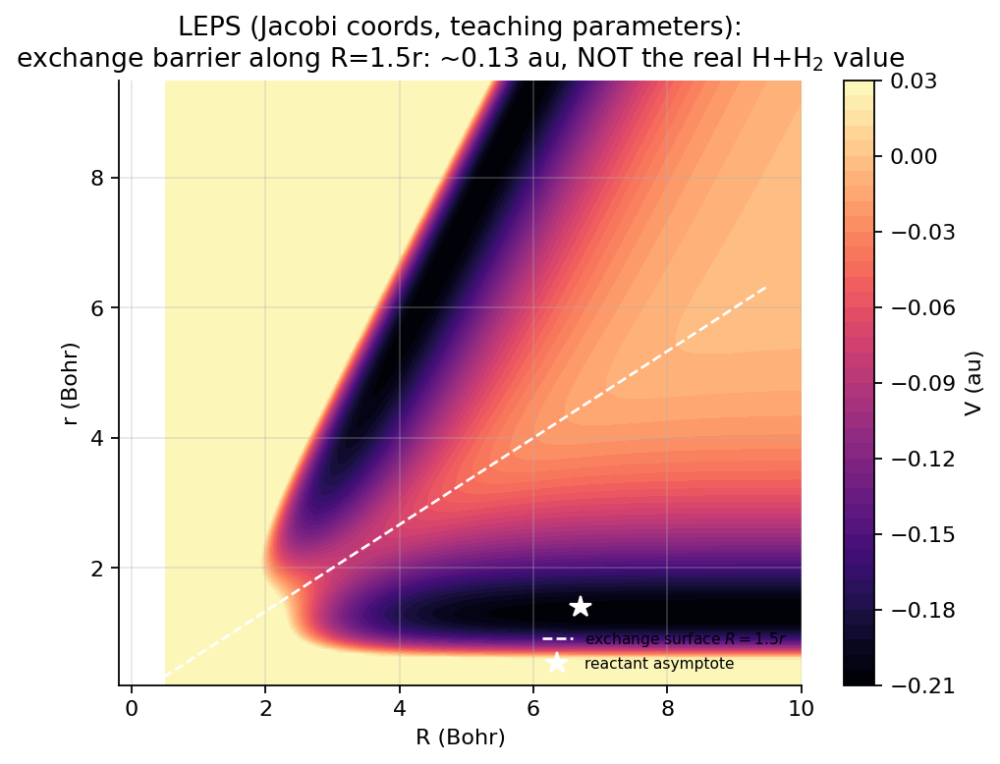

# 第 3 章 势能面

## 1. 本章导读

势能面 $V$ 是把电子结构问题压缩成核运动问题后的“地形图”。AutoQuantum 提供 Morse、谐振、Lennard–Jones、LEPS 和 Eckart 五类解析模型，以及承载外部数据的 `AbInitioData`；本章逐一说明这些 API 实际计算了什么。

本章特别区分解析面、教学参数和真实物理量。仓库中的某些默认参数适合传播算法和守恒测试，却不能直接代表实验体系。项目没有 ASE 或 PySCF 后端；所谓 AbInitio 数据容器只组织外部得到的点、能量和梯度，不执行电子结构计算。

## 2. 学习目标

- 能从原子几何说明键长坐标与 Jacobi 坐标的差异，并正确转换共线三原子构型；
- 能写出 Morse、谐振和 Lennard–Jones 势的形状、极值与主要参数；
- 能按 `LEPSPES` 的实现拆解 singlet/triplet、$Q$、$J$、Sato 缩放和交换势垒项；
- 能解释 Eckart 的 sech² 反应垒、谐振项和线性耦合为何会移动入口平衡位置；
- 能调用 `generate_grid` 与 `AbInitioData.sample_function`，并用中心差分梯度检查数据；
- 能识别 Bohr/Å、键长/Jacobi、模型阈值和电子结构后端方面的真实陷阱。

## 3. 新手路径

分子几何就是把原子当球、核间距离当软尺。键长坐标直接使用 $r_{AB}$、$r_{BC}$、$r_{AC}$，写公式直观；Jacobi 坐标则把“分子内部振动长度”和“分子整体靠近反应物”分开，对量子动力学更方便。共线时，这只是换坐标，不是改变物理。

Morse 势像一条有限高度、两端不平行伸展的深谷：$r_0$ 放在谷底，$D$ 控制井深，$\alpha$ 控制谷壁陡峭程度。谐振势只保留谷底附近的抛物线，LJ 则描述两粒子的排斥—吸引。前者适合单键振动，后者的 $r^{-12}$ 项在很短距离会急剧增大。

LEPS 把两对原子之间的成键与交换贡献组合起来，是常见教学反应面；Eckart 则把复杂反应路径近似成可控高度和宽度的光滑垒。三原子交换过程中内外键的“角色交换”可在 Jacobi 图上用 $R=3r/2$ 分界，帮助定义反应与反射通道。



*图 3.1: LEPS 教学参数下的共线交换势能面 (Jacobi 坐标), 白色虚线为交换分界面 $R=1.5r$, 星号为反应物渐近区。注意标题声明: 该参数化的势垒远高于真实 H+H₂。*

*全部配图由 `scripts/make_book_figures.py` 基于真实计算生成 (可复现); 坐标轴标签为英文。*

## 4. 公式与推导

### 4.1 分子几何、键长坐标与 Jacobi 坐标

设三原子为 A–B–C，键长为 $r_{AB}$、$r_{BC}$、$r_{AC}$。键长坐标是三个非负长度，但存在三角形约束；它们不显式分离“总伸缩”和“相对伸缩”。

对等质量、共线的 H+H₂，Jacobi 坐标定义为 $r=r_{BC}$，$R$ 为 A 到 BC 质心的距离。几何关系给出

$$
r_{BC}=r,\qquad r_{AB}=R-\frac r2,\qquad
r_{AC}=R+\frac r2. \tag{1}
$$

交换后 A、C 角色互换，产物条件是 $r_{AB}<r_{BC}$，即 $R<3r/2$。对称伸缩模和反对称伸缩模是 Jacobi 坐标中的简正坐标近似，反应通道则可由交换分界面定义。

核动能为

$$
\hat T=-\frac{1}{2\mu_R}\frac{\partial^2}{\partial R^2}
-\frac{1}{\mu_r}\frac{\partial^2}{\partial r^2},\qquad
\mu_R=\frac{2m}{3},\quad\mu_r=\frac m2, \tag{2}
$$

其中 $m_H=1836.15$ au。式 (2) 与第 02 章一致，势能面必须和同一坐标、同一质量约定配套。

### 4.2 Morse 势

`autoquantum/pes/analytic.py` 实现

$$
V_M(r)=D\left[1-e^{-\alpha(r-r_0)}\right]^2. \tag{3}
$$

平衡点在 $V'_M(r_0)=0$ 且 $V''_M(r_0)=2D\alpha^2>0$。当 $r\to\infty$ 时 $V_M\to D$，而 $r\to-\infty$ 因指数发散；因此绝不能把 Morse 势解释到负键长或极短距离而不检查数值稳定性。

仓库默认值是 $D=0.1744$ au、$\alpha=1.028$、$r_0=0.7416$。$D$ 约为 $4.75$ eV，接近 H₂ 解离能；但代码长度单位是 Bohr，因此默认 `r0=0.7416` 实际表示 $0.7416$ Bohr，而不是物理 H₂ 平衡键长 $0.7416$ Å $\approx1.401$ Bohr。这里存在明显的教学参数/单位混用风险，不能把该默认值称为经验 H₂ 势。

### 4.3 谐振势

实现为

$$
V_H(r)=\frac{k}{2}(r-r_0)^2. \tag{4}
$$

它在 $r=r_0$ 取全局最小值 0，局部小振动频率为 $\omega=\sqrt{k/\mu_r}$。$V_H$ 正是第 02 章谐振子势的“坐标加势能”形式。Eckart 面也复用这一结构。

### 4.4 Lennard–Jones 势

实现为

$$
V_{LJ}(r)=4\epsilon\left[\left(\frac{\sigma}{r}\right)^{12}
-\left(\frac{\sigma}{r}\right)^6\right]. \tag{5}
$$

令 $u=(\sigma/r)^6$，求导可得 $u=1/2$，故 $r_{\min}=2^{1/6}\sigma$、$V(r_{\min})=-\epsilon$。12 次项描述短程排斥，6 次项描述远程色散吸引。Lennard–Jones 传统上描述两粒子相互作用；把多原子反应统一成单个键长 $V(r)$ 时，物理含义必须另行说明。

### 4.5 LEPS 的 $Q/J$ 构造

令 $x=q-r_0$。`LEPSPES` 定义 singlet 和 triplet 两套标量函数

$$
Q_s(q)=D(e^{-2\alpha x}-2e^{-\alpha x}),\qquad
Q_t(q)=D(e^{-2\alpha x}+2e^{-\alpha x}), \tag{6}
$$

$$
J_s(q)=\frac{Q_s(q)-Q_t(q)}2=-2D e^{-\alpha x},\qquad
J_t(q)=-J_s(q). \tag{7}
$$

对三对原子取

$$
Q_{ij}=\frac{Q_s(r_{ij})+Q_t(r_{ij})}{2},\qquad
J_{ij}=\frac{Q_s(r_{ij})-Q_t(r_{ij})}{2}. \tag{8}
$$

Sato 参数 $s$ 对所有 $J$ 做相同缩放：

$$
J_{ij}\leftarrow J_{ij}\frac{1+s}{1-s}, \tag{9}
$$

最后得到

$$
V=Q_{AB}+Q_{BC}+Q_{AC}
-\sqrt{\frac12\left[(J_{AB}-J_{BC})^2+
(J_{BC}-J_{AC})^2+(J_{AC}-J_{AB})^2\right]}. \tag{10}
$$

代码用 `np.maximum(J2, 0)` 防止浮点误差造成开方负数，但这不补救错误的键长输入。仓库默认 $s=0.05$ 的共线交换 MEP 垒约为 $0.14$ au，即约 $3.8$ eV；它显著高于真实 H+H₂ 的约 $0.4$ eV，是算法教学模型，不能用于声称复现真实反应阈值。

### 4.6 Eckart 势垒面

`autoquantum/pes/eckart.py` 的三部分为

$$
V_{\rm reaction}=\frac{V_0}{\cosh^2[\beta(R-3)]}
=V_0\,\operatorname{sech}^2[\beta(R-3)], \tag{11}
$$

$$
V_{\rm vibration}=\frac{k_r}{2}(r-r_0)^2,\qquad
V_{\rm coupling}=c(r-r_0)\tanh[\beta(R-3)], \tag{12}
$$

总势为三者之和。sech² 从两端平滑趋于 0，在 $R=3$ 取 $V_0$。默认 $V_0=0.015$ au，按 $1$ au $=27.2114$ eV 换算约为 $0.408$ eV，接近真实 H+H₂ 垒高量级；这仍是量级教学模型，不等于高精度从头算面。

耦合项使给定 $R$ 下的势能最小值满足

$$
r_{\rm eq}(R)=r_0-\frac{c}{k_r}\tanh[\beta(R-3)]. \tag{13}
$$

因此初态不能总放在 $r=r_0$。仓库示例在 $R=6$ 时按式 (13) 对心入口振动波包。

### 4.7 AbInitioData 与梯度采样

`AbInitioData` 保存 `points`、`energies`、可选 `gradients`；其 `sample_function` 在每维规则的 Cartesian 网格上生成 $n_{\rm per\,dim}^d$ 个点。对第 $j$ 维步长 $\epsilon$ 使用中心差分

$$
\frac{\partial V}{\partial x_j}\approx
\frac{V(\mathbf x+\epsilon\mathbf e_j)-V(\mathbf x-\epsilon\mathbf e_j)}
{2\epsilon}. \tag{14}
$$

噪声在无噪声梯度算完后才加到能量上。式 (14) 对光滑解析面通常为 $O(\epsilon^2)$，但量子化学能量噪声、极点、非光滑插值面和过大步长会破坏这一性质。

## 5. 与代码的对应

`autoquantum/pes/analytic.py` 的三个类都接受参数字典并实现 `evaluate`/`__call__`。以 Morse 为例，代码没有额外加偏移或截断：

```python
self.D = params.get("D", 0.1744)
self.alpha = params.get("alpha", 1.028)
self.r0 = params.get("r0", 0.7416)

def evaluate(self, x):
    r = np.asarray(x, dtype=float)
    return self.D * (1 - np.exp(-self.alpha * (r - self.r0))) ** 2
```

`autoquantum/pes/leps.py` 的 `LEPSPES.__call__` 若省略 `r_AC`，默认设为 $r_{AB}+r_{BC}$，适用于直接给定三键长的共线几何。必须注意：`LEPSBuilder.evaluate_2d(R,r)` 自身把输入映射为 `(r_AB, r_BC, r_AC)=(r,R,r+R)`，它不是第 02 章的物理 Jacobi $(R,r)$ 动力学接口。实际 `leps_jacobi_pes` 位于 `autoquantum/dynamics/wavepacket_2d.py`，返回

```python
def V(R, r):
    R = np.asarray(R, dtype=float)
    r = np.asarray(r, dtype=float)
    return inner.evaluate(R - 0.5 * r, r, R + 0.5 * r)
```

`autoquantum/pes/eckart.py` 的 `EckartBuilder.generate_grid` 使用 `indexing="ij"`，所以 `V.shape == (n_R, n_r)`，与二维 FFT 数组布局一致。

`autoquantum/pes/abinitio.py` 明确写明不执行电子结构计算。`sample_function` 接受形如 `lambda pts: pes(pts[:,0], pts[:,1])` 的函数，并返回已装入有限差分梯度的 `AbInitioData`；噪声尺度是 `noise_level * max(abs(values))`。

## 6. 动手实验

在仓库根目录运行以下代码，读取 Eckart 默认垒顶，并生成正确 Jacobi 坐标化的 LEPS 梯度数据。

```python
import numpy as np
from autoquantum.pes.eckart import EckartBuilder
from autoquantum.pes.leps import LEPSBuilder
from autoquantum.pes.abinitio import AbInitioData
from autoquantum.dynamics import leps_jacobi_pes

eck = EckartBuilder()
print("Eckart barrier [au]:", eck.evaluate_2d(np.array(3.0), np.array(1.401)))
V = leps_jacobi_pes(LEPSBuilder())
func = lambda pts: V(pts[:, 0], pts[:, 1])
data = AbInitioData.sample_function(
    func, [(0.5, 8.0), (0.2, 6.0)], 45, grad_h=1e-4)
print("points:", data.points.shape, "gradients:", data.gradients.shape)
h = 1e-4
fd = (V(data.points[:, 0] + h, data.points[:, 1]) -
      V(data.points[:, 0] - h, data.points[:, 1])) / (2 * h)
print("max grad error:", np.max(np.abs(fd - data.gradients[:, 0])))
```

再运行 `python autoquantum/examples/h3_wavepacket.py --pes eckart` 和 `python autoquantum/examples/h3_wavepacket.py --pes leps`，检查二维势能图、通道概率与守恒恒等式。

## 7. 常见陷阱

1. **Bohr 与 Å 混用**：代码坐标是 Bohr。`analytic.py` 的 Morse 默认 `r0=0.7416` 不能当作物理 H₂ 的 $0.7416$ Å；LEPS 的 `r0=1.401` 才是 Bohr 数值。
2. **负“键长”**：解析势没有物理约束，负 $r$ 会被照常计算；Morse 可能溢出，LJ 在 $r=0$ 发散。
3. **LEPS 双重映射**：`LEPSBuilder.evaluate_2d` 不等于 `leps_jacobi_pes`。二维修真动力学必须使用后者。
4. **把 LEPS 教学阈值当真实物理量**：默认交换垒约 $0.14$ au，不是真实 H+H₂ 的约 $0.4$ eV。
5. **Sato 参数越界**：$s\to1$ 时 $(1+s)/(1-s)$ 发散，$s<0$ 的物理意义也应重新论证。
6. **Eckart 初态不随耦合对心**：入口平衡位置是式 (13)，不是常数 $r_0$。
7. **把 `AbInitioData` 当计算后端**：它不调用 ASE/PySCF；外部数据来源必须由使用者负责。
8. **在噪声上直接求差分**：`sample_function` 特意先算梯度再加噪；改变顺序会放大噪声。
9. **数据划分不可复现**：`AbInitioData.split` 使用全局 `np.random.permutation`，调用前应按实验需求设置随机种子。

## 8. 高手专栏

Morse 势的解析本征值为

$$
E_n=\hbar\omega_e\left(n+\frac12\right)
-\frac{\hbar^2\omega_e^2}{4D}\left(n+\frac12\right)^2, \tag{15}
$$

其中 $\omega_e=\alpha\sqrt{2D/\mu_r}$，但低能级更稳健的表示是相对于井底的位移。Eckart 垒的平滑性与经典跃迁理论相容，但式 (11)–(12) 加入振动和耦合后不再是单一 Eckart 势垒的严格可分离模型。

真实从头算势能面的误差不仅来自能量 RMSE，也包括偶极、耦合常数和区域连接方式。量子动力学对非光滑拼接尤其敏感，局部能量误差小不等于反应概率可靠。LEPS 中平方根项还可能在不同电子态处出现锥形交叉；使用 `maximum(...,0)` 只能保持数值域，不能恢复缺失的物理细节。`quantum_2d.py` 的二维定态方法仍为实验性，不能用来验证上述模型已给出真实二维反应动力学。

## 9. 本章小结 + 自测题

本章把势能面看成坐标明确、零点明确、参数可审计的模型，而不是“神经网络之前的一张神秘曲面”。Morse 和谐振势提供可解析的一维结构，LEPS 提供三对键长耦合，Eckart 提供可控反应垒；所有二维调用必须明确自己传的是键长坐标还是 Jacobi 坐标。

<details>
<summary>自测题答案</summary>

1. 共线 Jacobi 坐标下三键长是什么？答：$r_{BC}=r$、$r_{AB}=R-r/2$、$r_{AC}=R+r/2$。
2. `analytic.py` 的 Morse 默认 `r0=0.7416` 有什么问题？答：代码单位是 Bohr，所以它不是物理 H₂ 的 0.7416 Å；这是教学/单位风险。
3. LEPS 中 Sato 缩放如何写？答：$J_{ij}\leftarrow J_{ij}(1+s)/(1-s)$。
4. Eckart 默认垒高是多少？答：$V_0=0.015$ au，约 $0.41$ eV。
5. `sample_function` 为什么不执行电子结构？答：它只调用用户提供的标量 `func`，容器负责保存采样点、能量和差分梯度。

</details>

## 参考资料

- P. Atkins、R. Friedman, *Molecular Quantum Dynamics*.
- R. Kosloff, J. Phys. Chem. 92, 2087 (1988).
- D. Neuhauser, J. Chem. Phys. 90, 4351 (1989).
- G. C. Schatz, Rev. Mod. Phys. 61, 669 (1989).
- S. Sato, J. Chem. Phys. 23, 592 (1955).
- NumPy Documentation: `numpy.meshgrid`, `numpy.gradient`。

## 3.6 从头算后端与训练数据生成 (v0.8.0)

### 3.6.1 统一协议与实现边界

v0.8.0 增加的 `Calculator` 把不同电子结构程序收束到同一接口。输入坐标为 $\mathbf R\in\mathbb R^{(N_{\rm atoms},3)}$，单位是 Bohr；能量与核坐标梯度满足

$$
E_{\rm elec}=E(\mathbf R)\;[\mathrm{Hartree}],\qquad
\mathbf G=\nabla_{\mathbf R}E\;[\mathrm{Hartree/Bohr}]. \tag{3.6.1}
$$

`energy(coords)` 返回一个 Hartree 标量，`gradient(coords)` 返回形状 $(N_{\rm atoms},3)$ 的数组，`energy_and_gradient(coords)` 默认依次组合二者。有原生联合计算能力的后端可覆盖第三项，避免重复求解。力与梯度的关系是

$$
\mathbf F=-\mathbf G. \tag{3.6.2}
$$

本项目把坐标、能量和梯度单位与动力学模块对齐：符合该约定的后端在进入训练与传播时无需单位换算。这里的梯度是能量对**核坐标**的导数，不是力。

现有实现分为两类。`AnalyticCalculator` 包装解析能量函数；若没有提供 `gradient_fn`，便对每个笛卡尔分量使用中心差分，精度受 `grad_h` 控制。`XTBCommandCalculator` 以子进程执行 `xtb coordfile --grad`，用正则表达式读取 `TOTAL ENERGY` 和 `gradient (Eh/a0)` 块，要求本机已安装 `xtb` 且在 `PATH` 中。`PySCFCalculator` 是可选依赖，覆盖 RHF、UHF、ROHF 与 DFT；`ASECalculatorAdapter` 可包装任意 ASE calculator，并把 ASE 返回的力取负号作为梯度。`demo_calculator` 提供内置 Lennard–Jones 二聚体解析后端，便于零依赖检查采样—训练闭环。

**诚实边界**：仓库发布验证环境没有安装 `xtb`、`pyscf` 和 `ase`，这些真实后端未经端到端数值验证，不能据此宣称精度合格。数据可复现性也不是一个 `--backend xtb` 就能保证；程序版本、周期表版本、基组、交换相关泛函、电荷、自旋、收敛阈值等必须完整记录。`provenance` 会随数据集保存，缺少关键设置时，数值本身不足以复现实验。

`backends` 只能报告本机可发现性，不能替代基准测试。实际数据任务还应检查：程序是否正常收敛、能量零点是否一致、梯度方向是否通过有限差分、以及不同硬件或线程设置是否改变结果。对 ASE 适配器，所选 calculator 也必须遵守本节输入输出约定；适配器只取力的负号，不承担隐式单位转换。

### 3.6.2 笛卡尔几何采样与数据格式

`AbInitioData.sample_geometries` 从参考几何出发，对 `active_atoms × axes` 指定的每个“原子—坐标轴”维度建立均匀位移网格：

$$
\mathbf R^{(k)}_{i\alpha}
=\mathbf R^{\rm ref}_{i\alpha}+\Delta_k,\qquad
k\in(\text{active atoms})\times(\text{axes}). \tag{3.6.3}
$$

`ranges` 可为每维分别指定范围；只有一个范围时，它会广播到全部采样维度。`n_per_dim` 控制每维点数，组合数可能按幂增长。生成候选后，方法删除最小原子间距小于 `min_distance` 的坍缩几何；若数量超过 `max_points`，便用固定 `seed` 均匀子采样。随后逐点调用 `energy_and_gradient`。

若系统有 $N$ 个原子，训练特征不是键长，而是展平的笛卡尔坐标：

$$
\mathbf x=\operatorname{vec}(\mathbf R)\in\mathbb R^{3N}. \tag{3.6.4}
$$

因此 `points.shape == (n, 3N)`，`energies.shape == (n,)`，几何梯度 `gradients.shape == (n,N,3)`；训练时再把后者按 C 序 reshape 为 $(n,3N)$，与网络特征逐项对应。这里存在明确局限：**Cartesian 特征无对称性**。交换等价原子会得到不同排列，网络必须重新学习同一物理构型的置换等价性。

这也意味着训练集必须保持原子顺序一致：若参考 XYZ 中调换两行，坐标列和梯度列的含义随位置变化，简单把各分量直接重标会把物理构型拆散。`geometry` 数组保留原始 $(n,N,3)$ 结构，便于审计；正式模型若需要平移、旋转或原子置换不变性，应在特征层显式构造距离、键角等描述符，而不是只扩大笛卡尔网络。

`save_npz(path)` 保存 `points`、`energies`、可选 `gradients`、可选几何数组，以及序列化后的 `provenance_json`；`AbInitioData.load_npz(path)` 恢复这些字段。来源记录应和数据集一起归档，不能只保存最终能量表。

### 3.6.3 命令行闭环

先检查本机后端：

```bash
autoquantum backends
```

再生成一个只移动 1 号原子的笛卡尔数据网格：

```bash
autoquantum sample --backend demo|xtb|pyscf --input ref.xyz -o data.npz \
  --n-per-dim 5 --range -0.4 0.4 --active-atoms 1 --min-distance 1.2
```

Shell 中需把 `demo|xtb|pyscf` 换成其中一个实际值；`demo` 只验证管线，不是量子化学。训练时把梯度作为附加监督量：

```bash
autoquantum fit --data data.npz -o model.pkl --force-weight 1.0
```

生成的模型可直接复用：

```python
from autoquantum.nn.model import PESNN, nn_pes_2d
model = PESNN.load("model.pkl")
```

若另行训练的模型输入恰为二维坐标 $(R,r)$，`nn_pes_2d(model)` 会生成传播器所需的 $V(R,r)$ 闭包，再交给 `WavePacket2DPropagator`。`sample_geometries` 默认产生的 $3N$ 维分子特征不能未经坐标映射就冒充二维 $(R,r)$ 特征。

### 3.6.4 新手路径：谁是“老师”

可以把数据想成带答案的练习册：后端是老师，几何是题目，能量标签是答案。后端换得越慢、越贵，每道题的标签就越珍贵；`--force-weight 1.0` 表示除能量外，还让网络学习 $\nabla_{\mathbf x}E$，从而约束势能面的斜率。训练误差小只是答对练习题，不等于模型已覆盖未采样的反应通道。

第一次运行时，可先用 `demo` 跑通文件、形状和梯度链路，再切换真实后端。比较拟合结果时至少同时看能量误差与梯度误差，并另取未参与训练的位点检查。只降低训练集 RMSE，却让关键区域的力误差变大，通常会直接伤害波包传播。

### 3.6.5 高手专栏：主动学习的位置

当前 `sample_geometries` 决定“在哪里提问”，可替换为 D-optimal 设计、committee 分歧采样或轨迹驱动采样，再用同一 `Calculator` 与数据格式接口接入主动学习闭环。D-optimal 偏向减少参数协方差，委员会分歧则把标签预算投向多个模型意见不一致的区域；二者都应保留固定随机种子与被拒候选的审计信息。GHOST、Virtual Database（VDB）与力匹配可复用附近构型、代理点或低阶模型的信息，减少重复从头算，但近似误差和缓存命中规则必须随数据版本记录。

DFT 数值梯度通常要扰动 $3N$ 个坐标，标签成本会随体系迅速增长，因此“先做小体系基线、再决定方法等级”比直接追求高精度更重要。周期性边界、元素覆盖、基组与赝势版本也会改变标签分布；不同电荷、自旋多重度或反应通道不能混入同一张未加标记的表。仅保存能量文件而不保存这些选择与设置，不构成可审计的科学数据集。

### 3.6.6 自测题

1. `gradient(coords)` 的形状和单位是什么？它与力相差什么符号？
2. 为什么默认 `energy_and_gradient` 不一定省计算？
3. `points` 为什么是 $(n,3N)$，而不是键长或 Jacobi 坐标？
4. 最小间距过滤和 `max_points` 各解决什么问题？
5. 为什么 `demo` 闭环通过不能证明 xTB 标签正确？
6. 若把梯度 $(n,N,3)$ 用于展平特征训练，reshape 后应是什么形状？

<details>
<summary>自测题答案</summary>

1. 形状为 $(N,3)$，单位 Hartree/Bohr；力为 $\mathbf F=-\nabla_{\mathbf R}E$。
2. 默认组合会分别调用能量与梯度；支持原生梯度的后端应覆盖该方法，只运行一次。
3. `sample_geometries` 返回展平笛卡尔坐标，形状为 $(n,3N)$；键长和 Jacobi 坐标需另做特征工程。
4. 前者剔除原子过近的坍缩几何，后者限制组合网格带来的计算量。
5. demo 是虚构 LJ 对势，只验证数据管线和 API；它不检验电子结构程序的能量、梯度或收敛设置。
6. 形状为 $(n,3N)$，顺序与 `coords.reshape(n,-1)` 一致。

</details>
