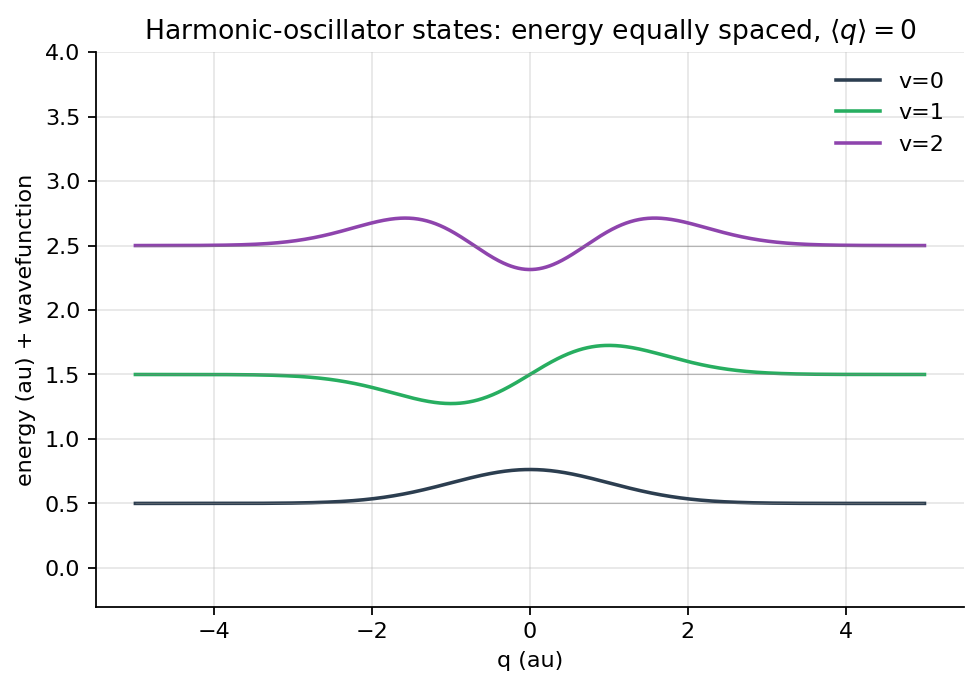
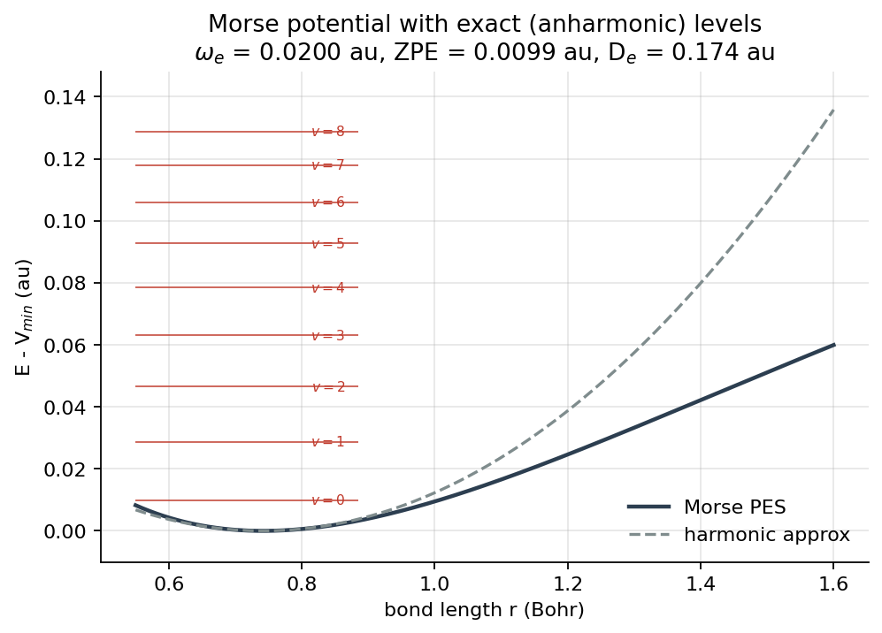
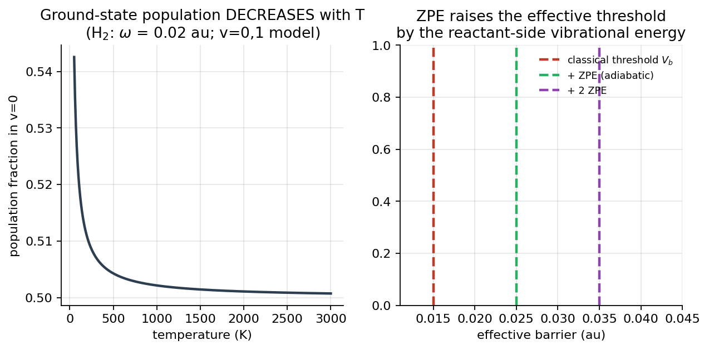

# 第 6 章 分子振动与能量转移

## 1. 本章导读

第 03 章给出一条 Born–Oppenheimer 势能曲线，第 04 章说明电子结构程序如何在这条曲线上计算能量与核坐标梯度。它们回答的是“固定核构型时，电子系统有多稳定”，还没有回答“两个核究竟怎样运动”。本章补上这层基础：把电子势能面转成核振动 Hamiltonian，得到离散的振动态，再说明这些状态如何在碰撞中转移能量。

本章也是第 07 章定态散射的前置知识。双原子分子在远场通常有“质心平动”和“键长振动”两个自由度；碰撞中还要区分弹性、非弹性和反应通道。AutoQuantum 目前没有专门的振动光谱或态匹配模块，因此本章用解析势和现成一维波包工具作可复现的示范，并把可直接从电子能量推到振动态的部分讲清楚。

## 2. 学习目标

- 能从 Born–Oppenheimer 势能面写出双原子分子的核振动 Hamiltonian，并说明约化质量从何而来；
- 能推出谐振子的能级、零点能、$\langle x\rangle=0$ 与 $\langle x^2\rangle\ne0$；
- 能用 Morse 势解释非谐性、间距收缩、有限束缚态和光谱线间隔；
- 能区分经典转向点、零点运动与量子隧穿，并描述 V→T、V→V 能量转移；
- 能用本仓库的 `MorsePES`、`HarmonicPES`、`QuantumScattering1D`、`WavePacket1D` 和 `SplitOperatorPropagator` 做一维演示；
- 能检查 Bohr、Hartree、$m_H=1836.15$、$\hbar=1$ 以及 `sigma` 为振幅宽度的单位约定。

## 3. 新手路径

先想象一个被拉伸的分子键像一根系住两个小球的弹簧。经典小球可以在弹簧势阱里来回摆动；量子分子却没有一条确定的轨道，键长由波函数描述。振动态的能量是分立的：基态已经有一个不可抹去的零点能，每一个激发电像再增加一个“振动量子”。

小提琴弦也遵守驻波条件，但“弦长固定、由一列波描述”的画面只是帮助记忆。更重要的是，分子振动和分子整体平动可以交换能量：振动量子下降一点，外界平动能量就增加一点。温度是对大量分子状态的统计描述，不是某一个分子拥有的“温度”。因此，热分子只需较低的相对平动能量，就可能跨越反应势垒。



*图 6.1 谐振子前几级本征函数。各能级等间距，概率密度关于平衡点对称；$\langle x\rangle=0$ 不等于分子静止不动。本文图片由 `scripts/make_book_figures.py` 从真实代码生成，可复现；图中坐标轴标签使用英文是有意的设计。*

## 4. 公式与推导

### 4.1 从 Born–Oppenheimer 面到核振动 Hamiltonian

设二聚体由质量为 $m_A,m_B$ 的两个核组成，核间距为 $r$，质心坐标为 $X$。定义

$$
\mu=\frac{m_Am_B}{m_A+m_B},\qquad
X=\frac{m_AR_A+m_BR_B}{m_A+m_B},\qquad x=r-r_e. \tag{6.1}
$$

这里 $r_e$ 是势阱平衡键长，$x$ 是相对平衡位置的位移。质心总质量 $M=m_A+m_B$。由质心坐标和 Jacobi 键坐标的正交变换可得

$$
\hat T_n=\frac{\hat P_X^2}{2M}+\frac{\hat p_r^2}{2\mu}
=-\frac{1}{2M}\frac{\partial^2}{\partial X^2}
-\frac{1}{2\mu}\frac{\partial^2}{\partial r^2}. \tag{6.2}
$$

平动部分给出第 07 章的入射波数和通量；内部振动部分记为

$$
\hat H_{\rm vib}=\frac{\hat p_x^2}{2\mu}+V_{\rm BO}(r_e+x),
\qquad \hat p_x=-i\hbar\frac{\partial}{\partial x}. \tag{6.3}
$$

若要显式使用质量加权坐标 $q=\sqrt{\mu}\,x$，则 $p_q=p_x/\sqrt{\mu}$，有

$$
\hat H_{\rm vib}=\frac{\hat p_q^2}{2}
+V_{\rm BO}\!\left(r_e+\frac{q}{\sqrt{\mu}}\right). \tag{6.4}
$$

式 (6.4) 看似把质量“消掉”了，代价是势能变成 $q$ 的非对称函数。所有频率和动能计算都必须知道采用的是 $x$ 还是 $q$。

### 4.2 谐振子、零点能与位移扩散

在 $x=0$ 附近把势能展开到二阶，$V(x)\simeq V(r_e)+\tfrac12k x^2$，并定义 $\omega=\sqrt{k/\mu}$。于是

$$
\hat H_{\rm harm}=\frac{\hat p_x^2}{2\mu}
+\frac12\mu\omega^2x^2,\qquad
E_v=\hbar\omega\left(v+\frac12\right),\quad v=0,1,\ldots . \tag{6.5}
$$

基态能量 $E_0=\tfrac12\hbar\omega$ 是零点能（ZPE）。由本征函数的对称性，

$$
\langle x\rangle=0,\qquad
\langle x^2\rangle=\frac{\hbar}{\mu\omega}\left(v+\frac12\right),
\qquad
\Delta x=\sqrt{\frac{\hbar}{2\mu\omega}}. \tag{6.6}
$$

这就是零点能与位移涨落的关系：频率越高或有效质量越大，波函数越窄；即使均值为零，分子仍在零点附近做零点运动。电子结构程序在第 04 章给出的通常是 Born–Oppenheimer 能量和梯度，ZPE 不应擅自加进力标签；是否加 ZPE 必须由动力学模型单独声明。

### 4.3 Morse 势、非谐性与光谱

有限键长的 Morse 势为

$$
V_M(r)=D\left[1-e^{-\alpha(r-r_e)}\right]^2. \tag{6.7}
$$

其井底附近频率为

$$
\omega_e=\alpha\sqrt{\frac{2D}{\mu}},
$$

解析振动态能量为

$$
E_v=\hbar\omega_e\left(v+\frac12\right)
-\frac{\hbar^2\omega_e^2}{4D}\left(v+\frac12\right)^2. \tag{6.8}
$$

第二项是非谐性修正，负号使高能级下降且相邻间距收缩：

$$
\Delta E_v=E_{v+1}-E_v
=\hbar\omega_e-\frac{\hbar^2\omega_e^2}{2D}(v+1). \tag{6.9}
$$

令 $\lambda=2\mu D/(\hbar^2\alpha^2)$，只有 $v+\tfrac12<\lambda$ 的态才束缚，束缚态数约为 $v_{\max}=\lfloor\lambda-\tfrac12\rfloor$。Morse 井的有限深度正是“不能无限抬高振动”的来源。



*图 6.2 谐振近似与 Morse 势的量子能级。低能级接近等间距，高能级间距收缩；最低能级相对井底的高度是 ZPE。图片由 `scripts/make_book_figures.py` 的真实计算生成，可复现，坐标轴标签按设计使用英文。*

把 $E_v$ 记作光谱项值 $G_v$ 时，一步跃迁的谐振近似给 $h\nu_e=\hbar\omega_e$；Morse 近似则给

$$
\Delta E_{v\to v+1}=h\nu_e-2B_e(v+1),
\qquad
B_e=\frac{\hbar^2\omega_e^2}{4D}. \tag{6.10}
$$

真实分子的选择定则和振动—转动耦合还会改变可见谱线；本仓库没有自动计算这些选择定则或进行态匹配的模块。极冷分子束流通常主要占据 $v=0$，这使阈值实验接近“最低反应物振动态”，但不代表所有分子都完全没有振动。

### 4.4 经典与量子振动

经典谐振子的能量为 $E=\tfrac12\mu\omega^2A^2$，转向点为 $x_t=\pm A=\pm\sqrt{2E/(\mu\omega^2)}$。量子基态没有静止点，能量集中在经典禁区 $E< V(r_e)+\tfrac12\hbar\omega$ 附近。若势垒足够窄，WKB 近似给出透射概率随禁阻区作用量指数衰减，这就是零点振动导致的量子隧穿；它不是经典小球“爬过去”的过程。

### 4.5 振动能量转移与反应阈值

对碰撞 $A+BC$，若电子态不变，通道总能量满足

$$
E_{\rm trans}^{R}+E_{\rm vib}^{R}
=E_{\rm trans}^{P}+E_{\rm vib}^{P}. \tag{6.11}
$$

当 $v$ 降低而平动能增加时称为振动到平动（V→T）；两个分子或振动模之间交换一个或多个量子则称为振动到振动（V→V）。这些都是非弹性通道。严格守恒的是总能量，不是振动量子数；“振动量子数守恒”只是在碰撞时间短、耦合突变的近似下对 $v$ 标签的描述。温度给出占据分布，平均平动能约为每个平动自由度 $\tfrac12 k_BT$；对单个分子应直接指定平动能量和振动态，而不应套用热平衡的单一温度。



*图 6.3 反应物侧振动能抬高有效阈值的示意。ZPE 改变的是反应物初始振动态的能量，经典势垒顶仍是 PES 的几何高度。图片由 `scripts/make_book_figures.py` 计算生成，可复现；英文坐标轴标签为有意的设计。*

### 4.6 从束缚态到散射态

双原子分子先从两个自由度出发：质心平动 $X$ 和键长振动 $x$。真正的反应至少要涉及三原子，才能有旧键断裂、新键形成以及相对运动的分界面；共线 H+H$_2$ 的 Jacobi 坐标 $(R,r)$ 正是第 03、07 章的起点。描述入射通道到出射通道振幅关系时，可以把多通道散射矩阵 $S$ 理解为“所有非弹性连接的汇总”；第 07 章再详细讨论通量、边界和透射率。

## 5. 与代码的对应

`autoquantum/pes/analytic.py` 的真实实现是

```python
MorsePES.evaluate: D * (1 - np.exp(-alpha * (r - r0)))**2
HarmonicPES.evaluate: 0.5 * k * (r - r0)**2
```

它们都返回 Hartree 能量，坐标输入按 Bohr 解释。`WavePacket1D` 用 `exp[-0.5*((x-x0)/sigma)**2]` 初始化，所以 `sigma` 是振幅宽度；`SplitOperatorPropagator` 在一维网格上用 `T(k)=k**2/(2*mass)`。`QuantumScattering1D` 则把同一质量直接放进 $k^2=2m(E-V)$。`autoquantum/core/engine.py` 的一维管线把 `config.mass` 传给这两个工具；二维管线用 `h3_reduced_masses(m_H)` 得到 $m_R=2m_H/3$、$m_r=m_H/2$。默认 `PipelineConfig.mass=1.0` 是教学质量，不能直接解释为 H$_2$。

下面只用现有 1D 工具演示束缚井中的波包；仓库没有专门的振动光谱/态匹配模块。

```python
import numpy as np
from autoquantum.pes.analytic import MorsePES
from autoquantum.dynamics import WavePacket1D, SplitOperatorPropagator, trapezoid
r = np.linspace(0.35, 3.0, 1200)
mu = 1836.15 / 2
pes = MorsePES({"D": 0.1744, "alpha": 1.028, "r0": 0.7416})
psi0 = WavePacket1D(0.7416, 0.0, 0.08).initialize(r)
prop = SplitOperatorPropagator(mu, pes, r, 0.05, cap_edges=())
times, states = prop.propagate(psi0, 1000, save_every=100)
print("surviving norm =", trapezoid(np.abs(states[-1])**2, r))
```

第 03/04 章的能量到振动态衔接是：在 $r_e$ 处得到电子 Born–Oppenheimer 能量，加上式 (6.5) 或式 (6.8) 的振动项，得到指定 $v$ 的初态能量；若 PES 零点已包含热修正或 ZPE，不能再次添加。

## 6. 动手实验

### 6.1 在 Morse 井中传播束缚波包

运行以下代码可绘制初态和末态密度；它对应图 6.1、6.2 的物理内容，但不是自动的本征值求解。

```python
import numpy as np
import matplotlib.pyplot as plt
from autoquantum.pes.analytic import MorsePES
from autoquantum.dynamics import WavePacket1D, SplitOperatorPropagator, trapezoid
r = np.linspace(0.35, 3.0, 1200); mu = 1836.15/2
pes = MorsePES({"D": .1744, "alpha": 1.028, "r0": .7416})
psi = WavePacket1D(.7416, 0., .08).initialize(r)
prop = SplitOperatorPropagator(mu, pes, r, .05, cap_edges=())
t, out = prop.propagate(psi, 1000, save_every=100)
plt.plot(r, pes(r), label="Morse potential")
plt.plot(r, abs(out[0])**2, label="t=0")
plt.plot(r, abs(out[-1])**2, label="t=%.1f au" % t[-1])
plt.legend(); plt.xlabel("r (Bohr)"); plt.ylabel("density (au^-1)"); plt.show()
```

### 6.2 H$_2$ 谐振频率与实验波数

用 $1\ \mathrm{Hartree}=219474.631\ \mathrm{cm}^{-1}$ 把实验谱线换算到本项目的角频率单位：

```python
import numpy as np
from autoquantum.pes.analytic import HarmonicPES
mu = 1836.15/2
nu_cm = 4401.0
omega = nu_cm / 219474.6313705
k = mu * omega**2
print("omega [au] =", omega)
print("computed wavenumber [cm^-1] =", np.sqrt(k/mu)*219474.6313705)
print("experimental =", nu_cm)
print("zpe [au] =", .5*omega, "k =", k)
# HarmonicPES({"k": k, "r0": 1.401}) 才是这组频率对应的势。
```

这里给出的 $\omega\simeq0.0200$ au 是 H$_2$ 振动频率的已知量级；仓库默认 `HarmonicPES(k=1.0)` 不是该分子参数。

### 6.3 观察波包宽度“呼吸”

谐振势中，相干波包的中心会摆动，宽度会周期性收缩和扩张。`sigma` 仍表示初始振幅宽度；第 08 章的 `ch08_wavepacket_evolution.png` 将展示同一现象。

```python
import numpy as np
import matplotlib.pyplot as plt
from autoquantum.dynamics import WavePacket1D, SplitOperatorPropagator, trapezoid
x = np.linspace(-10, 10, 800)
psi = WavePacket1D(-4., 4., .5).initialize(x)
prop = SplitOperatorPropagator(1., lambda q: .5*q*q, x, .05,
                              cap_width_frac=.1, cap_height=.5)
t, states = prop.propagate(psi, 160, save_every=10)
width = [np.sqrt(trapezoid((x-trapezoid(x*abs(p)**2, x))**2*abs(p)**2, x)) for p in states]
plt.plot(t, width); plt.xlabel("time (au)"); plt.ylabel("density std. dev.")
plt.title("harmonic wavepacket breathing"); plt.show()
```

## 7. 常见陷阱

1. **ZPE 重复计入**：电子能量/力标签通常不含 ZPE；若模型已含热修正或人为加了零点位移，不能再加一次。
2. **用哈密顿频率代替 Morse 频率**：阈值和高振动态估算应使用式 (6.9) 的实际间距，谐振近似只适用于低能级。
3. **把 $v=0$ 当成零振动能**：$v=0$ 的能量是 $\tfrac12\hbar\omega$，不是零。
4. **混用键长和键长位移，或混用 $x$ 与 $q$**：频率会出现质量因子错误；质量加权变换后势能也必须变换。
5. **把单分子叫作热平衡**：温度是系综统计量；碰撞计算应报告平动能量、振动量子数和时间分布。
6. **只背 $\Delta J=\pm1$**：这是振动—转动光谱的一个选择定则片段，还需考虑偶极矩、$\Delta v$、对称性和具体电子态。
7. **把解析 Morse 波包当谱线计算**：现有一维工具能做传播或散射演示，不自动给出振动态匹配、跃迁强度或实验谱线。

## 8. 高手专栏

真实分子的振动—转动耦合可用 rovibrational Hamiltonian 处理：转动常数与振动量子数、离心畸变和自旋—轨道耦合相关。Dunham 展开把谱项写成
$G(v)+BJ(J+1)+DJ^2(J+1)^2+\cdots$；基线常数 $B_e$ 之外，非谐性常数为 $x_eB_e=\hbar^2\omega_e^2/(4D)$。对多原子分子，先做质量加权的 Hessian 分析，把正常坐标变换为简正模式，才能谈“某个键的频率”；简正模式通常不是某一条键的独立振动。

电子结构方法还决定 ZPE 的变分误差。谐振频率来自二阶导数，泛函、基组和数值频率会改变 $\omega$；对线性分子出现虚频时，说明该驻点不是可靠极小值，不能把所有频率都机械代入式 (6.5)。束流或喷流通过碰撞耗散和低温膨胀降低转动、振动占据，使反应物更接近 $v=0$ 态，因而测到的有效阈值更接近基态反应；这不是把实验温度设为零，而是减少热平均。

## 9. 本章小结 + 自测题

本章从电子势能面得到核振动 Hamiltonian：Jacobi 键坐标决定约化质量，谐振近似产生等间距能级和不可消除的零点能，Morse 非谐性使高能级收缩并限制束缚态数。V→T、V→V 说明振动量子可在碰撞中与平动或另一振动模交换；从双原子的平动—振动两自由度走向三原子反应，才能建立第 07 章的通道与散射矩阵语言。

<details>
<summary>自测题答案</summary>

1. 为什么 $v=0$ 仍有能量？答：量子基态有零点能 $\hbar\omega/2$。
2. $\langle x\rangle=0$ 能否说明分子不动？答：不能；$\langle x^2\rangle$ 非零，表示零点运动和位置涨落。
3. Morse 势为何能级收缩？答：式 (6.8) 的二次负项随 $v$ 增大。
4. `sigma` 是位置标准差吗？答：不是；代码把它定义为振幅宽度。
5. V→T 是什么？答：振动能降低而平动能增加的非弹性能量转移。
6. 为什么反应至少需要三原子？答：需要同时描述旧键、新键和相对运动的分界。
7. 本仓库能否直接算 H$_2$ 振光谱？答：不能；这里没有专门的光谱、选择定则或态匹配模块。

</details>

## 参考资料

- P. Atkins、R. Friedman, *Molecular Quantum Dynamics*.
- G. Herzberg, *Molecular Spectra and Molecular Structure*, Vol. I: Spectra of Diatomic Molecules（Molecular Spectraims）。
- Barone、Czeszynski, *Molecular Spectroscopy*。
- P. M. Morse, *Physical Review* **44**, 777 (1929)。
