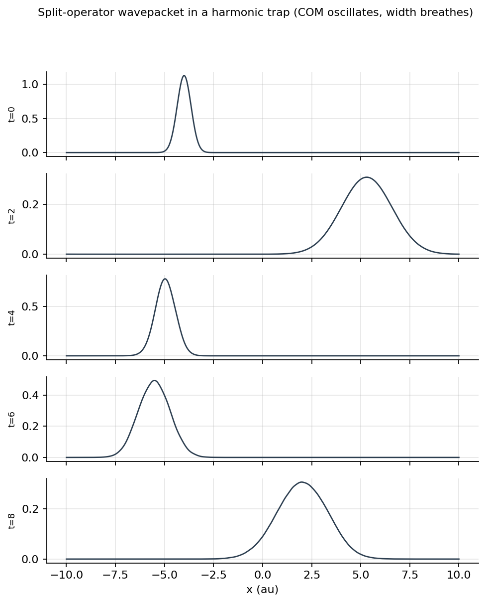
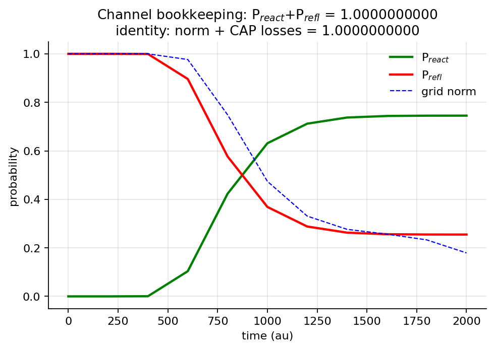

# 第 8 章　含时波包

## 1. 本章导读

定态法先给每个能量单独求解；含时法则同时撒下一束能量，用一张波函数快照记录它碰垒、反射、隧穿和反应。AutoQuantum 的主路径用 FFT 计算动能、用 Strang 对称分裂耦合势能与动能，并用复吸收势（CAP）阻止 FFT 的周期回绕。

本章使用 $\hbar=1$、Hartree、Bohr 和 $m_H=1836.15$。我们将从一个高斯波包出发，逐行读懂 `wavepacket.py` 的一维实现，再进入已经定量验证的 `wavepacket_2d.py`。第 7 章的定态 $T(E)$ 仍会回来：波包给的是能量加权的透射，而不是中心能量点值。所需算符语言可回查“01 数学预备”“02 量子力学基础”，输入势面见“03 势能面”“05 神经网络势能面”，反应坐标见“09 二维反应动力学”，验证、软件与拓展分别见“10 数值验证”“11 软件架构与发布”“12 进阶专题”，单位约定汇总于“附录”。

## 2. 学习目标

1. 正确计算高斯包的位置、动量与能量宽度；
2. 推导自由演化和 FFT 动能算符；
3. 掌握 Strang 分裂及二阶误差来源；
4. 用 CAP 做吸收，并逐格核对概率账本；
5. 使用互补通道掩码解释二维反应与反射概率。

## 3. 新手路径

高斯波包像一小组紧束的波，每束代表一个动量。整体越窄，位置越确定；由不确定性原理，动量就跨越更宽范围。因此一次波包计算天然带有能量分辨率。σ 太大像一团雾，峰值可信但能量太糊；σ 太小像针，位置清楚却会携带很大的高、低能分量。

自由空间中，动量算符是乘法器，动能算符是对角矩阵，所以 FFT 一步就得到全局相位旋转：每个 $k$ 分量只改变相位，不混合。加入势能后，可用很小的时间片做“转一半—自由走—转一半”。这就是 split-operator。

真实网格总有限。波走到边缘若突然截断，FFT 会把它从另一端卷回来，像橡皮筋把球弹回。CAP 在边缘平滑降低振幅，并记录到底吸走了多少概率。概率不会神秘消失：网格存活量加各 CAP 累计损失必须为一。



*图 8.1: 分裂算符推进的一维波包 (质心振荡、宽度呼吸) — 自由传播是 k 空间对角相位的直接后果。*



*图 8.2: 反应/反射通道概率与存活范数随时间演化; 互补掩码下两条通道之和与 $\mathrm{norm}+\mathrm{CAP}$ 恒等式在 $10^{-9}$ 量级成立。*

*全部配图由 `scripts/make_book_figures.py` 基于真实计算生成 (可复现); 坐标轴标签为英文。*

## 4. 公式与推导

一维含时薛定谔方程在 Jacobi 坐标或一般反应坐标中写为

$$
i\frac{\partial\psi}{\partial t}=\hat T\psi+V(x)\psi,
\qquad
\hat T=-\frac{1}{2\mu}\frac{\partial^2}{\partial x^2}.
\tag{6.1}
$$

以 $x_0$ 为中心、$p_0$ 为平均动量的最小高斯包是

$$
\psi(x,0)=N\exp\left[-\frac{(x-x_0)^2}{2\sigma^2}\right]
\exp[i p_0(x-x_0)].
\tag{6.2}
$$

这里 $\sigma$ 是**振幅宽度**：

$$
|\psi|^2\propto\exp\left[-(x-x_0)^2/\sigma^2\right].
\tag{6.3}
$$

直接积分可得位置标准差 $\sigma_x=\sigma/\sqrt2$；傅里叶变换给出动量标准差 $\sigma_p=1/(\sqrt2\sigma)$。若 $p_0\ne0$，最低二阶能量展宽约为 $\Delta E\simeq |p_0|\sigma_p/\mu$；在 $p_0\approx0$ 时常引用 $\Delta E\sim1/(4\mu\sigma^2)$，其系数依高斯与能量区间定义而变。仓库 docstring 使用的就是这个量级。

动量表象中 $V$ 通常非对角，不易精确作用；FFT 自由演化则为

$$
\psi(t)=\mathcal F^{-1}\left[e^{-ik^2t/(2\mu)}\mathcal F(\psi(0))\right].
\tag{6.4}
$$

这也解释为何 momentum-space kinetic evolution 是自然路径：每个 FFT 频点独立相变。复势写成

$$
W=V-i\eta,\qquad \eta\ge0,
\tag{6.5}
$$

于是 $e^{-iWdt/2}=e^{-iVdt/2}e^{-\eta dt/2}$；边缘处 $\eta$ 平滑增大，振幅被阻尼。一个时间步的 Strang 分裂为

$$
U(\Delta t)\approx e^{-iW\Delta t/2}
e^{-i\hat T\Delta t}
e^{-iW\Delta t/2}.
\tag{6.6}
$$

它关于 $\Delta t$ 二阶对称，时间反演误差的三阶项互相抵消。CAP 必须包含在每一步前、后两个半势中，才能保持这个二阶结构；只在步末附加阻尼会破坏对称性。二维实现把 CAP 直接并入复势；一维 `wavepacket.py` 则先做两个实势半步，再以 `exp(-eta*dt)` 施加整步对角 CAP，并在同一循环中记账，这仍保留实际运算的对称效果，但结构不如二维版本显式。

网格守恒应逐时满足

$$
P_{\rm grid}(t)+\sum_e L_e(t)=1,
\tag{6.7}
$$

其中 $L_e$ 是边 $e$ 的累计吸收概率；每一步从阻尼前后密度差直接求得。二维通道概率定义为

$$
P_{\rm react}=P_{\rm product}+
\sum_{e\in product}L_e,\qquad
P_{\rm refl}=P_{\rm reactant}+
\sum_{e\notin product}L_e.
\tag{6.8}
$$

若 product 与 reactant mask 互斥且覆盖整个网格（无重叠、无空隙），则

$$
P_{\rm react}+P_{\rm refl}=1.
\tag{6.9}
$$

它们是有限传播时间的通道估计；产物波包可再穿越分界面，不能自动等同于无限时间渐近产额。

在谐振子 $V=\frac12kq^2$ 中，$\omega=\sqrt{k/\mu}$，精确基态满足式 (6.3) 且质心静止，所以振幅宽度是

$$
\sigma_0=\frac1{\sqrt{\mu\omega}}.
\tag{6.10}
$$

Morse 势常以 $V=D(1-e^{-\alpha q})^2$ 表示，阱底曲率给 $\omega=\alpha\sqrt{2D/\mu}$，于是谐振近似使用同一 $\sigma_0=1/\sqrt{\mu\omega}$；非谐修正确实存在。

耦合 Eckart 入口通道还发生平衡位置移动。仓库势的振动态为 $\frac12k_r(r-r_0)^2+\mathrm{coupling}\,(r-r_0)\tanh[\beta(R-3)]$，在固定 $R$ 令 $\partial_rV=0$，得

$$
r_{\rm eq}=r_0-\frac{\mathrm{coupling}}{k_r}
\tanh[\beta(R_0-3)].
\tag{6.11}
$$

engine 与示例都按此对心，而不是机械地把初态放在 $r_0$。

## 5. 与代码的对应

一维 `WavePacket1D.initialize` 的高斯指数为 `-0.5*((x-x0)/sigma)**2`，随后乘相位并用梯形积分归一；这正是式 (6.2)。`SplitOperatorPropagator.__init__` 用

```python
k = 2 * np.pi * np.fft.fftfreq(self.grid.size, self.dx)
T = 0.5 * (k ** 2) / self.mass
self.exp_T = np.exp(-1j * self.dt * T)
```

把式 (6.4) 预计算。`step` 依次执行两个 `exp_V_half`、FFT、乘 `exp_T`、逆 FFT；`last_absorbed` 则由阻尼前后的概率差得到。左右二次 ramp 从边界值 1 平滑降到 0。

历史问题也被明确保留在代码中：早期初始化没有转为 complex，`trapezoid` 使用实数数组，导致模块实际上不能完整运行；NumPy 2 移除 `np.trapz` 后，helper 优先用 `np.trapezoid`，旧版再回退 `np.trapz`。`propagate` 还修复了末步不在保存周期的 off-by-one。

二维 `WavePacket2D` 接受 $(R,r)$，使用二维 $\sigma_R,\sigma_r$；`WavePacket2DPropagator` 的 `kR`、`kr` 都来自 `numpy.fft.fftfreq`，动能矩阵既可为对角约化质量形式，也可由 `g_matrix` 含交叉项。复势半步是：

```python
self.exp_W_half = np.exp(
    -0.5j * self.dt * (self.V - 1j * self.eta_total))
```

角点同时属于两条 CAP 时，代码按该格点 $\eta$ 最大的边确定性归因，总吸收不重复计数。`check_initial_overlap` 返回初始态落入任一 CAP 区域的概率；engine 对 $>10^{-5}$ 警告、$>10^{-4}$ 直接报错。旧版 LEPS 曾因窄 $r$ 网格导致 CAP 覆盖初态，概率账本虽能守恒，动力学初态却已被静默污染。

验证结果必须带条件。1D Eckart 波包对解析谱透射率的三能量、三网格基准误差小于 $4\times10^{-4}$；可分离二维 Eckart 对能量加权一维参考，在中心碰撞能 0.02、0.04 au 时差 0.002、0.004；谐振子基态传播 126 步的密度最大漂移为 $3.4\times10^{-6}$。这些是当前测试设置下的数值验证，不代表任意网格和 CAP 都自动定量可靠。

## 6. 动手实验

下面的不超过 20 行代码运行真实的一维 API，关闭 CAP 时验证自由质心运动：

```python
import numpy as np
from autoquantum.dynamics import WavePacket1D, SplitOperatorPropagator

x = np.linspace(0, 8, 512)
mu = 2*1836.15/3
E = 0.02
packet = WavePacket1D(x0=6.0, p0=-np.sqrt(2*mu*E), sigma=0.5)
prop = SplitOperatorPropagator(
    mu, lambda q: 0.015/np.cosh(1.5*(q-3.0))**2,
    x, dt=0.5, cap_edges=())
psi = packet.initialize(x)
saved = 0.0
for _ in range(400):
    psi = prop.step(psi)
    saved += sum(prop.last_absorbed.values())
dx = x[1]-x[0]
print(np.sum(abs(psi)**2)*dx + saved)
```

二维示例可直接运行：

```bash
cd /Users/lihao/Library/CloudStorage/SynologyDrive-aecho/AIcreating/AQD/AutoQuantumDynamics
python autoquantum/examples/h3_wavepacket.py --pes eckart --steps 3000
python -m pytest tests/test_wavepacket.py tests/test_wavepacket_2d.py -q
```

再做 CAP 开/关、宽度和步长三组对照；关闭 CAP 的结果只能用于无回绕短时间演示，不能当最终散射结果。

## 7. 常见陷阱

- 宽度差 $\sqrt2$：振幅宽度 $\sigma$ 对应位置标准差 $\sigma/\sqrt2$。把位置标准差误传给 `WavePacket1D` 或 `WavePacket2D` 会挤压激发态。
- CAP 位置：太窄会与初态或近渐近区重叠；太宽、太高会提前吸收。恒等式守恒不证明初态没被污染，所以必须先调用 `check_initial_overlap`。
- 阻尼位置：二维复势必须在两个半步都出现，不能把阻尼只补在步末后仍声称 Strang 二阶。
- 能量标签：`WavePacket2DScan` 的 `E` 明确是碰撞能 $E=p_R^2/(2\mu_R)$，不是含分子内振能的 $E_{\rm total}$。
- 掩码：只有 product/reactant 互补分区时，式 (6.9) 才精确成立；有空隙时和会小于一，有重叠时代码报错。
- 波包有限能量宽度与有限传播时间会留下慢尾；仓库没有自动能量反卷积和收敛判断，定量前须自行检查。
- 仓库默认 LEPS 是教学参数，共线交换 MEP 势垒约 0.14 au，不是真实 H+H₂ 的约 0.4 eV；其阈值不能冒充实验量。

## 8. 高手专栏

对 $A=W/2$、$B=T$，Strang 的局部误差首项为 $-\Delta t^3[A,[A,B]]/12$（差分记号依约定可差一个符号），因而全局二阶。FFT 动能本身在周期网格上是谱精度的，误差常由时间分裂、非光滑势、CAP 与有限传播时间支配。降低 CAP 强度能减少反射，却要求更大网格和更早吸收；降低步长则使计算量增加。

Gaussian wave packet 是许多量子散射计算的自然基。最小波包服从 $t$ 依赖相速度的经典自由传播，但分裂算符会加入色散和数值相位误差。长时间反应应比较不同 $\sigma$ 与 $dt$ 的收敛，而不是只延长一次运行。

`h3_reduced_masses()` 返回 $\mu_R=2m_H/3$、$\mu_r=m_H/2$。Jacobi 坐标的动能才真正包含两个约化质量；若 `g_matrix` 非对角，初始 `p_R0` 单独不再足以严格定义总碰撞能，必须重新检查能量语义。LEPS 的 `leps_jacobi_pes` 依赖共线几何关系 $r_{AB}=R-r/2$、$r_{AC}=R+r/2$，不能无提示地推广到三维角动量问题；角动量与旋转截面可进一步参考 Zare。

## 9. 本章小结 + 自测题

高斯包用位置宽度交换动量宽度；FFT 使自由动能演化一步完成，Strang 分裂以二阶方法组合势与动能；复势 CAP 同时吸收回绕并支持严格概率记账。基态宽度、入射通道对心和掩码分区看似是参数细节，实际决定了初态与结果定义。AutoQuantum 的波包路径已有明确数值基准，但有限能量宽度、有限时长和未自动反卷积仍是定量使用的边界。

<details>
<summary>自测题答案</summary>

1. σ 减半后位置标准差和动量标准差怎样变？分别变为约 $1/\sqrt2$ 和 $\sqrt2$ 倍。
2. 为什么 CAP 放在两个半势中？这样保持对称分裂和二阶时间误差结构。
3. `P_grid + Σ CAP losses = 1` 能证明初态未被 CAP 污染吗？不能，还要检查初始重叠。
4. 波包扫描的 E 是什么？是 $p_R^2/(2\mu_R)$ 的碰撞能，不是总能量。
5. 何时有 $P_{\rm react}+P_{\rm refl}=1$？两 mask 互斥且无空隙、完整划分网格时。

</details>

## 参考资料

- Kosloff, R. *J. Phys. Chem.* **92**, 2087 (1988).
- Neuhauser, D.; Baer, M. *J. Chem. Phys.* **90**, 4351 (1989).
- Feit, M. D.; Kirkfeldt, J. A.; McCammon, M. D. *J. Chem. Phys.* **76**, 4200 (1982).
- Atkins, P. W.; Friedman, R. S. *Molecular Quantum Dynamics*. Wiley.
- Zare, R. N. *Angular Momentum*. Cambridge University Press.
- Press, W. H. et al. *Numerical Recipes*. Cambridge University Press.
