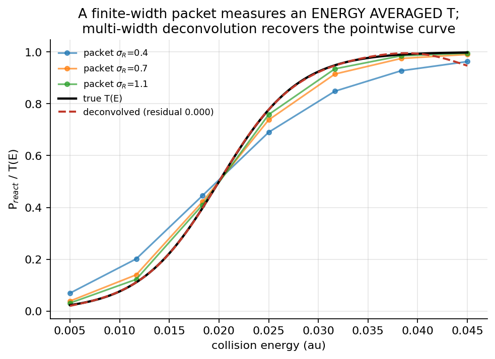

# 12 进阶专题

本章是 AutoQuantum v0.6.0 原型的路线图。除“当前状态”明确写出“已实现”的部分外，以下都是**尚未实现的研究设计**，不是现成 API。原型坚持解析势面、中心差分/FFT 动力学、可用有限差分核验的纯 NumPy NN，以及能报告守恒误差的有限时间波包。

## 12.1 能量反卷积

*图 12.1: 有限宽度波包测得的是能量平均 (圆点曲线 ≠ 点值 T); 多宽度联合 + 曲率正则反卷积恢复阈值曲线 (虚线 vs 真值)。*

*全部配图由 `scripts/make_book_figures.py` 基于真实计算生成 (可复现); 坐标轴标签为英文。*

**动机。** 有限宽度波包测量的是能量包络，而非某一能量点。若入射能量密度为 $\tilde a(E')$，单能透射率为 $T(E')$，则充分传播后的观测为
$$
P(E)=\int|\tilde a(E')|^2T(E')\,dE'.
$$
`WavePacket2DScan` 的 `energy_*` 是碰撞能 $E=p_R^2/(2\mu_R)$，不是总能量；扫描只改变中心动量、不改变 $\sigma_R$，所以结果是包络平均。`TestEckartSeparable` 已用能量加权 1D 参考验证此语义。

**多宽度反卷积。** 对多个振幅宽度 $\sigma_j$，用能量分段基 $T(E)\simeq\sum_n\theta_n\phi_n(E)$，令
$A_{jn}=\int|\tilde a_j(E')|^2\phi_n(E')\,dE'$，求
$$
\min_{\mathbf c}\sum_jw_j\|A_j\mathbf c-\mathbf P_j\|_2^2+\lambda\|\mathbf c\|_2^2.
$$
$\mathbf P_j$ 是第 $j$ 个宽度的观测；分段点要覆盖阈值/共振，$\lambda$ 用交叉验证选择，并报告条件数、边界振荡和不确定度。病态来自卷积核的 Fourier 衰减：窄包虽提高分辨率，却恶化矩阵条件数并放大 CAP、积分和有限时长误差。替代的“超窄包+逐点扫描”易实现，但需要更细的 $R,r$ 网格、更小 $\Delta t$、更长传播和更多波包。

Baer–Neuhauser 的 T2P 从波函数快照提取通道复谱振幅与相位，再逆变换；它**不能**把仓库 `reaction_prob` 的累计概率曲线直接当冲激响应。状态：**未实现**；先做多宽度、CAP 间隔和传播时间门控。指针：`wavepacket_2d.py` 的 `WavePacket2DScan`、`WavePacket2DResult`。

## 12.2 主动学习与采样

规则网格 `AbInitioData.sample_function` 生成 $n_{\rm per\_dim}^{d}$ 个点并以中心差分附梯度，它还不是主动学习器。D-optimality 最大化信息矩阵 $\Phi^\mathsf{T}\Phi$ 的对数行列式；GHOST/VDB 选不确定性高的点；委员会分歧可写为 $\operatorname{Var}_m[\hat V_m(x)]$。选点应再乘动力学敏感性，而非只追能量 RMSE。

工程上可由 `sample_function` 建候选池，委员会评分后把少量新点合并为 `AbInitioData(points, energies, gradients)` 重训；现有类没有候选池/委员会/重采样循环。成本上，中心差分每点每维多两次函数调用，总量约 $(1+2d)C_{\rm PES}$（当前 `grad_h=1e-5`）；解析梯度通常一次评估加后处理，但本仓库没有 ASE/PySCF 后端，且需核验单位、坐标变换和对称性。状态：**路线图**。指针：`autoquantum/pes/abinitio.py`、`engine.py::_step_nn_fit_2d`。

## 12.3 力匹配与量子嵌入

力匹配最小化 $\sum_x\|\hat\nabla_xV-\nabla_xV^{QM}\|^2$，把误差优先放在传播敏感的梯度上；它与当前 `force_weight` 同属能量+力监督。$\lambda$-fitting 求
$$
\min_\lambda\sum_x|\hat V_\lambda-V^{QM}|^2+\lambda\|\hat F_\lambda-F^{QM}\|^2,
$$
显式折中能量和力。QISA 以 $H=\sum_\alpha h_\alpha$ 和辅助经典路径表达量子项，适合强场或量子环境嵌入；$\Delta$-learning 则学习 $\hat V_{\rm high}+\Delta V_{\rm low}$ 的残差，常比从零学整面便宜。状态：当前只实现能量+解析/中心差分力监督；QISA、$\lambda$-fitting、$\Delta$-learning **均未实现**。指针：`nn/train.py` 的 `combined_loss`、`input_gradient_backward`。

## 12.4 对称性与交换原子

H+H$_2$ 交换氢会改变 Jacobi 标签却不改变物理布居；当前用 $(R,r)$ 和几何分界面显式记账（`eckart_product_mask`、`leps_exchange_mask`），并非一般网络对称性。置换对称性可约化 H$_3$ 对称扇区；SE(3)/E(3) 不变性要求整体旋转/平移（E(3) 另含反射）不改变能量，permutation-invariance 只要求同类原子换序不改变标量输出，二者不可混用。对称和 $\sum_{i<j}G(r_{ij})$、Behler–Parrinello 高斯径向/角向函数可作未来描述符；当前网络直接输入 $(R,r)$，没有这些函数。状态：**未来工作**。指针：`wavepacket_2d.py` 的 H$_3$ 质量/交换掩码、`nn/model.py::gradient`。

## 12.5 高维与 GPU

高维会同时放大状态数、FFT 成本和 PES 样本数。Tensor-train/TTN 以低秩链压缩高维张量；Gauss–Hermite 积分离散适合低维乘积，DVR 在有限区间提供高阶离散，Chebyshev/稀疏基可缓解均匀 $N^d$ 爆炸。GPU 路线应先建立复数 FFT、批量波包和稀疏线性代数基准。原型 NN 采用纯 NumPy，是为了零额外深度学习依赖、可审计且能以 FD 验证；`requirements.txt` 仅列 NumPy/Matplotlib/SciPy。状态：**未实现的 GPU/TTN/DVR 路线**。指针：`WavePacket2DPropagator`、`nn/model.py`。

## 12.6 更大体系与模式选择性

6D H$_2$O$_2$ 不能只把 `(R,r)` 扩成 $R,r,\theta,\phi,\dots$：角动量、奇异线、内外坐标和边界条件会同时复杂化。曲率坐标沿反应路径、正交振子和扭转角展开，可解耦反应坐标与低频模式；mode-selective PES 再区分基态、振动激发和扭转通道。应先做 3D/4D 可分离验证，再做全维 grid-free 基变换，并逐一检查概率、通量归一化和非绝热耦合。当前支持 1D Morse/Harmonic/LJ 与 2D Eckart/LEPS 波包；四原子以上、曲率坐标和模式选择性均为**路线图**。指针：`README.md` 支持体系表、`knowledge_base/pes_theory.md`。
