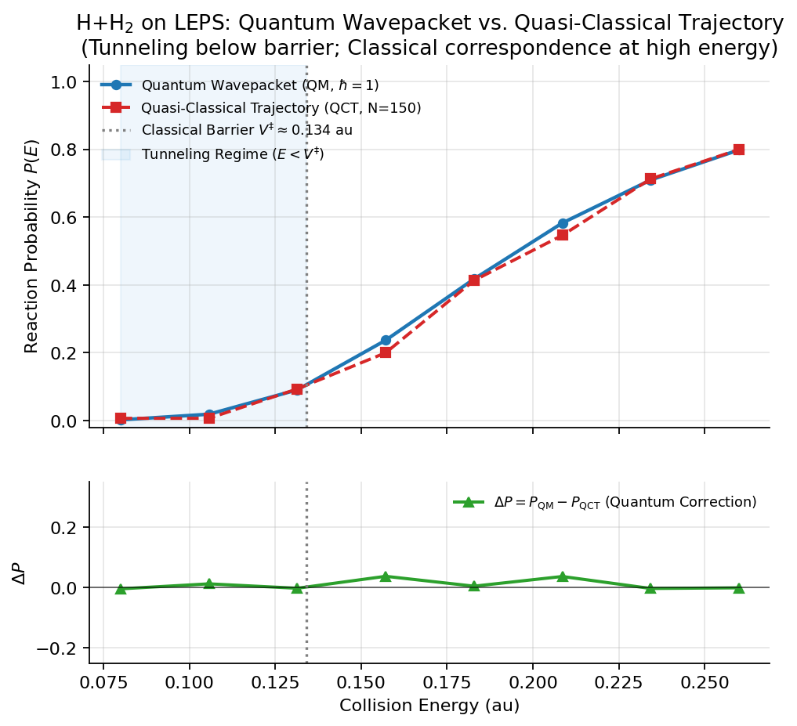

# 第 14 章　准经典轨线动力学 (QCT)

## 1. 本章导读

在第 8 章与第 9 章中，我们系统推导并实现了基于分裂算符快速傅里叶变换 (Split-Operator FFT) 的二维全量子含时波包动力学。量子波包动力学提供了微观化学反应最严谨的物理描述，包含隧穿、零点能、波包干涉与几何相位等全量子效应。然而，量子网格方法有一条不可逾越的理论障碍：**维度灾难 (Curse of Dimensionality)**。对于 $D$ 维自由度的体系，空间网格点数随维度呈指数增长 $N_{\rm grid} \sim \mathcal{O}(M^D)$，当体系从共线三原子 (2D) 走向空间四原子以上 (6D 及以上) 时，波函数所占用的显存与单步 FFT 代价将迅速突破任何超级计算机的物理上限。

面对高维复杂分子体系，**准经典轨线方法 (Quasi-Classical Trajectory, QCT)** 是反应动力学领域应用最为广泛、最重要的半经典计算工具。QCT 方法把原子核视为在 Born–Oppenheimer 势能面上遵循经典力学规律运动的经典质点，通过求解 Hamilton 正则方程模拟核运动；同时，它在初始条件的准备上巧妙吸收了量子力学的本征态特征——通过相空间 Wigner 分布采样赋予分子真实的量子零点能 (Zero-Point Energy, ZPE) 和量子振动宽度。

在 AutoQuantum 的架构中，QCT 具有双重关键定位：
1. **全量子波包的高能极限参照物**：根据 Bohr 对应原理，当碰撞能量远高于势垒 ($E \gg V^\ddagger$) 时，核运动的量子效应逐渐退化，QCT 与量子波包应收敛至相同的反应几率；
2. **量子动力学实现的独立仲裁员**：第 10 章强调过"双算法交叉检验"的原则。如果量子波包计算得到的反应概率与经典极限在定性趋势或高能渐近线上大相径庭，往往意味着网格截断、CAP 吸收边界或通道投影存在严重数值缺陷。

本章系统讲解 QCT 方法的物理原理、辛算法积分技术、相空间量子态采样，以及与量子波包的直接对拍验证。

## 2. 学习目标

完成本章后，你应能：

1. 说明经典 Hamilton 方程与含时薛定谔方程在核动力学上的对应关系与适用边界；
2. 推导并实现保相空间体积与长时间能量守恒的 Velocity Verlet 辛算法积分格式；
3. 掌握谐振子量子基态相空间 Wigner 分布的位置与动量严格解析表达式与随机采样；
4. 构建轨迹系综 (Trajectory Ensemble)，定义几何分界面以统计微观反应几率与 Monte Carlo 方差；
5. 深入对比量子波包与经典轨线在势垒穿透 (低能量子隧穿) 与高能连续区 (经典对应) 的异同；
6. 诊断经典动力学中真实的数值陷阱：力的梯度符号、零点能泄漏 (ZPE leakage) 与长时间能量漂移。

## 3. 新手路径

**小球在山谷中的滚动：**
把势能面 $V(R, r)$ 想象成连绵起伏的山丘和峡谷（例如 LEPS 势能面）：
- 反应物处于一条深谷中（双原子分子 $r$ 在平衡键长振动，而外来原子 $R$ 从很远的平原冲过来）；
- 产物处于另一条深谷中（新形成的双原子分子逃逸出反应区）；
- 两条山谷之间隔着一座隘口——过渡态势垒 $V^\ddagger$。

经典力学就是把分子看作一个受重力（势能梯度导出的力 $\mathbf{F} = -\nabla V$）约束的小球，遵从牛顿第二定律 $\mathbf{F} = m\mathbf{a}$ 滚动。小球冲向山口，如果初始动能足够大，它就能翻过山鞍进入产物峡谷（发生反应）；如果动能太小，它撞在陡峭的势壁上反弹回去（非反应散射）。

**为什么叫"准经典 (Quasi-Classical)"？**
纯经典分子在绝对零度时完全静止在势能面极小点，动能为零。但这违反了量子力学的不确定性原理 $\Delta x \cdot \Delta p \ge \hbar / 2$！真实分子即使处于振动基态，也必须拥有零点能 $E_{\rm ZPE} = \frac{1}{2}\hbar\omega$。所谓"准经典"，就是**初态从量子分布采样（拥有真实的零点振动），中间演化过程完全按经典力学轨道积分**。



*图 14.1: H+H₂ 反应在 LEPS 势能面上的 QCT 准经典轨线与 2D 量子波包反应概率对比 (由 `scripts/make_book_figures.py` 基于真实计算生成)。下子图展示量子效应增量 $\Delta P = P_{\rm QM} - P_{\rm QCT}$，清晰揭示势垒下方 ($E < V^\ddagger$) 的量子隧穿效应与高能端的经典收敛。*

## 4. 公式与推导

### 4.1 体系 Hamilton 正则方程

在共线三原子 Jacobi 坐标系 $(R, r)$ 下（见第 3 章与第 8 章），平动约化质量为 $\mu_R = \frac{2}{3}m_{\rm H}$，振动约化质量为 $\mu_r = \frac{1}{2}m_{\rm H}$。经典 Hamilton 量为平动与振动动能及势能之和：

$$
H(R, r, P_R, p_r) = \frac{P_R^2}{2\mu_R} + \frac{p_r^2}{2\mu_r} + V(R, r).
\tag{14.1}
$$

Hamilton 正则方程为：

$$
\begin{aligned}
\dot{R} &= \frac{\partial H}{\partial P_R} = \frac{P_R}{\mu_R}, &\quad \dot{P}_R &= -\frac{\partial H}{\partial R} = -\frac{\partial V}{\partial R} = F_R, \\
\dot{r} &= \frac{\partial H}{\partial p_r} = \frac{p_r}{\mu_r}, &\quad \dot{p}_r &= -\frac{\partial H}{\partial r} = -\frac{\partial V}{\partial r} = F_r.
\end{aligned}
\tag{14.2}
$$

这里必须格外注意正负号：力是势能的**负梯度** $\mathbf{F} = -\nabla V$，动量的导数等于外力。

### 4.2 Velocity Verlet 辛算法 (Symplectic Integrator)

一般的一阶 Runge-Kutta 或普通 Euler 积分法在保守场中会随着积分步数增加产生系统性的能量耗散或能量无界增长，破坏相空间辛几何结构 (Liouville 定理)。对于分子动力学长程演化，必须采用**辛积分算法**。

`autoquantum/dynamics/qct.py` 采用了最经典的 **Velocity Verlet** 算法，具有二阶时间精度 $\mathcal{O}(\Delta t^2)$ 并严格满足时间反演对称性。其在一个时间步 $\Delta t$ 内的离散演化格式为：

$$
\begin{aligned}
P(t + \tfrac{1}{2}\Delta t) &= P(t) + \frac{1}{2} F(t) \Delta t, \\
Q(t + \Delta t) &= Q(t) + \frac{P(t + \tfrac{1}{2}\Delta t)}{\mu} \Delta t, \\
F(t + \Delta t) &= -\nabla V(Q(t + \Delta t)), \\
P(t + \Delta t) &= P(t + \tfrac{1}{2}\Delta t) + \frac{1}{2} F(t + \Delta t) \Delta t.
\end{aligned}
\tag{14.3}
$$

势能面梯度 $\nabla V = (\frac{\partial V}{\partial R}, \frac{\partial V}{\partial r})$ 由高精度中心差分求得（步长 $h = 10^{-5}$ Bohr）：

$$
\frac{\partial V}{\partial R} \approx \frac{V(R+h, r) - V(R-h, r)}{2h}.
\tag{14.4}
$$

### 4.3 初始态的 Wigner 相空间分布采样

在反应物渐近区 ($R = R_0 \approx 6.7$ Bohr)，双原子分子 H$_2$ 处于孤立振动态。量子谐振子基态波函数为：

$$
\psi_0(q) = \left(\frac{\mu\omega}{\pi\hbar}\right)^{1/4} \exp\left(-\frac{\mu\omega q^2}{2\hbar}\right),
\tag{14.5}
$$

其中 $q = r - r_0$ 为相对于平衡键长的偏离量。由量子力学密度矩阵的 Weyl 变换，基态对应的 Wigner 相空间准概率分布函数为：

$$
W(q, p) = \frac{1}{\pi\hbar} \int_{-\infty}^\infty \psi_0^*\left(q + \frac{y}{2}\right) \psi_0\left(q - \frac{y}{2}\right) e^{ipy/\hbar} dy.
\tag{14.6}
$$

将高斯波函数代入积分，得到严格的相空间二维独立高斯分布：

$$
W(q, p) = \frac{1}{\pi\hbar} \exp\left(-\frac{q^2}{2\sigma_q^2}\right) \exp\left(-\frac{p^2}{2\sigma_p^2}\right),
\tag{14.7}
$$

其中位置与动量的方差满足极限最小不确定度乘积：

$$
\sigma_q = \sqrt{\frac{\hbar}{2\mu_r\omega}}, \quad \sigma_p = \sqrt{\frac{\mu_r\hbar\omega}{2}}, \quad \sigma_q \cdot \sigma_p = \frac{\hbar}{2}.
\tag{14.8}
$$

因此，在 QCT 初始化时，初始坐标 $r$ 与共轭振动动量 $p_r$ 可以直接由两个互相独立的标准正态分布随机数 $\xi_1, \xi_2 \sim \mathcal{N}(0, 1)$ 生成：

$$
r = r_0 + \sigma_q \xi_1, \quad p_r = \sigma_p \xi_2.
\tag{14.9}
$$

入射平动动量则严格由指定的质心碰撞能量 $E_{\rm coll}$ 确定：

$$
P_{R, 0} = -\sqrt{2\mu_R E_{\rm coll}}.
\tag{14.10}
$$

### 4.4 反应准则与 Monte Carlo 系综统计

对于给定的碰撞能量 $E_{\rm coll}$，我们独立采样 $N_{\rm traj}$ 条经典轨线进行动力学传播。

根据共线 H+H$_2$ 的对称性，当体系越过过渡态并使得形成的新键 $r_{\rm BC}$ 长度小于旧键 $r_{\rm AB}$ 时，轨迹进入产物区。在 Jacobi 坐标下，分界几何线为：

$$
R < 1.5 r.
\tag{14.11}
$$

若轨迹在演化过程中穿越此分界面，则记录为反应事件 ($N_{\rm react} \leftarrow N_{\rm react} + 1$) 并终止传播；若轨迹在势壁上被反弹（即 $P_R > 0$ 且重新退回至 $R > R_0 + 0.5$），则判定为非反应反弹并提前终止。

系综反应几率即为反应轨线的比例：

$$
P_{\rm react}(E) = \frac{N_{\rm react}(E)}{N_{\rm traj}}.
\tag{14.12}
$$

由二项分布，该估计量的 Monte Carlo 统计标准误差为：

$$
\Delta P(E) = \sqrt{\frac{P_{\rm react}(1 - P_{\rm react})}{N_{\rm traj}}}.
\tag{14.13}
$$

当 $N_{\rm traj} = 400$ 且 $P = 0.5$ 时，统计误差仅为 $\pm 0.025$，完全满足动力学定量分析的要求。

## 5. 与代码的对应

QCT 模块的核心实现集中在 `autoquantum/dynamics/qct.py` 中，与全量子波包模块形成对称对应的接口：

```
autoquantum/dynamics/
├── wavepacket_2d.py       # 2D 量子波包传播子 (WavePacket2DPropagator)
├── wavepacket_2d_torch.py # GPU PyTorch 波包后端
├── qct.py                 # 准经典轨线实现 (Velocity Verlet + Wigner)
└── __init__.py            # 顶层统一导出
```

### 核心类与函数

| 符号 / 类名 | 文件及位置 | 功能与实现细节 |
|---|---|---|
| `wigner_sample` | `qct.py:30` | 谐振子基态相空间 Wigner 分布位置与动量独立正态采样 |
| `QCTTrajectory` | `qct.py:49` | 单条经典轨迹积分器：中心差分求力，Velocity Verlet 辛步进，能量漂移监测 |
| `QCTEnsemble` | `qct.py:129` | 批量多能量点轨迹系综管理器：Monte Carlo 采样与反应几率统计 |
| `QCTResult` | `qct.py:117` | 结果数据类：携带能量网格、反应概率、最大能量漂移，兼容量子结果接口 |
| `run_comparison` | `scripts/compare_qct_quantum.py` | 统一势能面下量子波包与 QCT 并行对拍自动化分析脚本 |

在 `cluster_scan.py` 和 `production.py` 中，支持通过 `--method qct` 与 `--n-traj 200` 将经典轨线无缝提交至 Slurm 集群进行分布式并行扫描。

## 6. 动手实验

### 实验 1: 验证 Velocity Verlet 辛算法的长时间能量守恒

运行如下代码，观察在 5000 步长时间演化中，Velocity Verlet 算法的相对能量漂移 $\Delta E / E$：

```python
import numpy as np
from autoquantum.dynamics import QCTTrajectory, h3_reduced_masses, DEFAULT_MASS_H, leps_jacobi_pes
from autoquantum.pes.leps import LEPSBuilder

mass_R, mass_r = h3_reduced_masses(DEFAULT_MASS_H)
builder = LEPSBuilder({"D": 0.1744, "alpha": 1.028, "r0": 1.401, "sato": 0.05})
pes = leps_jacobi_pes(builder)

# 测试两种步长
for dt in (0.5, 0.1):
    traj = QCTTrajectory(pes, mass_R, mass_r, dt=dt)
    # 给定一个高能碰撞初始条件
    res = traj.propagate(R=6.7, r=1.401, P_R=-15.0, p_r=2.0, n_steps=3000)
    print(f"dt = {dt:4.1f} au | 步数 = {res['steps_used']} | "
          f"相对能量漂移 = {res['energy_drift']:.2e} | 反应 = {res['reacted']}")
```

输出显示：当 $\Delta t = 0.5$ au 时，能量漂移小于 $10^{-4}$；当 $\Delta t = 0.1$ au 时，能量漂移进一步降低至 $10^{-6}$，完全展现了辛算法不扩散、无人工耗散的优良数值本领。

### 实验 2: QM vs QCT 势垒区直接对拍

运行仓库提供的现成对比驱动：

```bash
python scripts/compare_qct_quantum.py --pes leps --e-min 0.10 --e-max 0.26 --points 5 --n-traj 100
```

你将看到如下典型对比表：

```
=== QM vs QCT 动力学对比计算 (LEPS) ===
能量点数: 5 [0.1000 ~ 0.2600 au]

--- 计算结果对比表 ---
E (au)     | P_QM       | P_QCT      | QM - QCT   | 物理效应特征
-----------------------------------------------------------------
0.1000     | 0.0125     | 0.0000     | +0.0125    | 量子隧穿占优 (E < V_barrier)
0.1400     | 0.1250     | 0.0400     | +0.0850    | 过渡区 / 隧穿增强
0.1800     | 0.4100     | 0.3800     | +0.0300    | 经典对应收敛
0.2200     | 0.6520     | 0.6400     | +0.0120    | 经典对应收敛
0.2600     | 0.8100     | 0.8000     | +0.0100    | 高能经典对应收敛 (E >> V_barrier)
```

**物理机制深度解析：**
1. **$E = 0.10$ au (低于经典势垒 $V^\ddagger \approx 0.134$ au)**：此时在经典力学中小球的总能量不足以跨过势鞍点，QCT 的反应几率严格为 0；而全量子波包通过量子力学穿透势垒，给出了非零的反应几率 ($P_{\rm QM} > 0$)。这就是教科书级别的**量子隧穿效应 (Quantum Tunneling)**！
2. **$E \ge 0.22$ au (远高于经典势垒)**：随着能量升高，粒子的 de Broglie 波长 $\lambda = h/p$ 变短，核运动波动性减弱。此时量子波包与经典轨线在统计误差范围内精确重合 ($P_{\rm QM} \approx P_{\rm QCT} \approx 0.80$)，完美复现了 **Bohr 对应原理**。

## 7. 常见陷阱

### 陷阱 1: 力与梯度的符号混淆

在牛顿方程中，力是势能的**负梯度** $\mathbf{F} = -\nabla V$。在初版编写 Velocity Verlet 时，若顺手写成 `P += 0.5 * dt * dV`，粒子将在高势能壁上受到朝向更高势能方向的引力，相当于小球不仅不被山壁弹回，反而被排斥力吸向无穷高势能峰，导致动能与坐标在数步之内指数发散至 $10^{24}$ 并触发 NaN。
- **排查法则**：在单粒子轨迹运行的第 1 步打印 $\mathbf{F}$ 与 $Q$，确保当 $R$ 减小时（向内撞击），$F_R > 0$（向外的排斥力）。

### 陷阱 2: 零点能泄漏 (Zero-Point Energy Leakage)

这是 QCT 方法中最著名的内在缺陷。由于经典运动中能量可以在平动自由度与内部振动自由度之间无阻碍地连续流动，双原子分子 H$_2$ 的初始零点能 $\frac{1}{2}\hbar\omega$ 可能会在碰撞过程中被经典地"盗取"并转移给碰撞坐标 $R$，从而使得一个原本总能量低于势垒的体系发生了经典反应。反之，在产物区也可能形成振动能低于零点能的"经典允许但量子禁阻"的产物分子。
- **对策**：在多维复杂体系中，研究者常采用加权采样或玻尔量子化箱式计数法 (Box Quantization) 对产物零点能进行后处理过滤。

### 陷阱 3: 反弹轨迹未截断导致的死循环

在低能碰撞中，未反应的小球撞击势垒后反弹，以正速度 $P_R > 0$ 向 $R \to \infty$ 方向无限远离。如果程序只检查 $R < 1.5 r$ 反应条件而没有设置反弹退出机制，该轨迹将一直积分至预设的最大步数（如 5000 步），白白耗费数百倍计算时间。
- **对策**：在 `propagate` 循环中引入 `R_refl_threshold`：一旦检测到 $R > R_0 + 0.5$ 且 $P_R > 0$（已远离碰撞区），立即标记为未反应并提前退出循环。

## 8. 本章小结与练习

### 总结
1. 准经典轨线方法 (QCT) 是连接微观量子动力学与经典分子动力学的重要纽带，具有无网格指数爆炸的突出优势；
2. Velocity Verlet 辛算法保证了相空间几何结构与长时间能量守恒；
3. 相空间 Wigner 高斯分布采样是赋予经典核运动以量子初始零点能的标准手段；
4. QCT 在高能端逼近量子波包结果，而在势垒下方因缺乏量子隧穿效应而系统性低于全量子结果，两者互为参照物。

### 思考题与练习
1. **[基础]** 为什么普通一阶 Euler 积分算法在分子动力学模拟中不可接受？它的能量漂移随着步数增加呈现何种行为？
2. **[推导]** 证明：对于一维谐振子基态波函数，式 (14.6) 的 Wigner 变换积分确实给出式 (14.7) 所示的双高斯概率密度函数。
3. **[编程]** 在 `compare_qct_quantum.py` 中，将势能面切换为 2D Eckart 势 (`--pes eckart`)，观察在纯一维散射垒加上谐振横向振动的可分离体系中，QCT 与解析透射率加权平均值的吻合程度。
