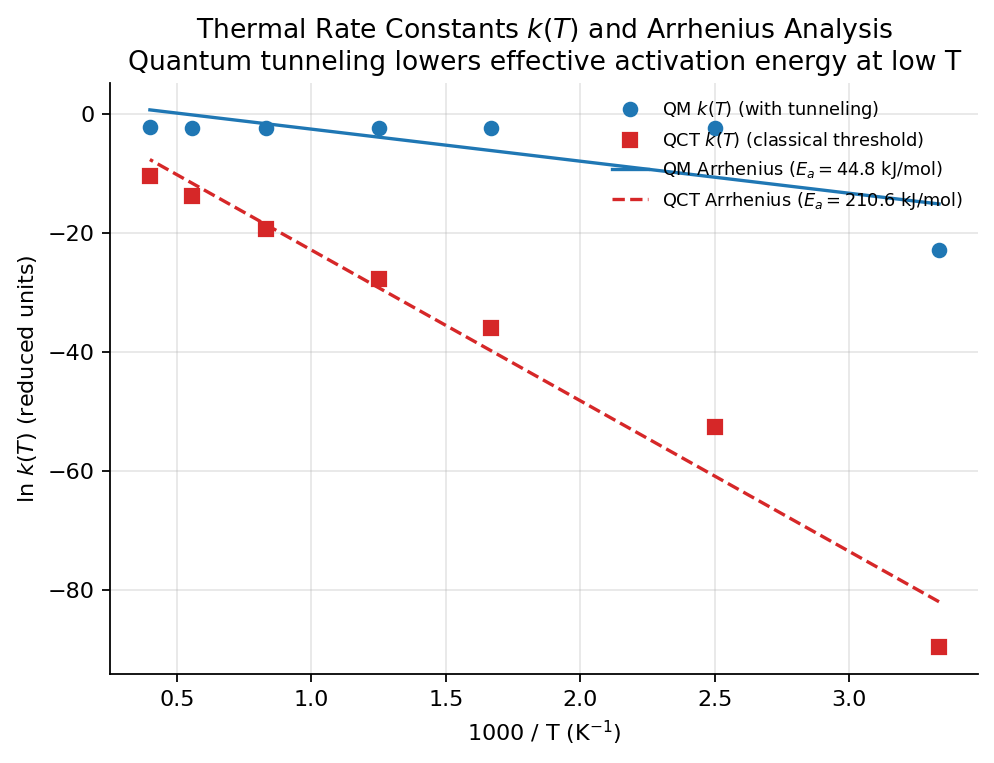

# 第 15 章　热速率常数与集群规模化计算

## 1. 本章导读

在前几章中，我们聚焦于微观单能散射与单次碰撞过程：通过求解含时薛定谔方程或经典 Hamilton 正则方程，我们获得了特定碰撞能量 $E_{\rm coll}$ 下的微观反应概率 $P(E)$。然而，实验室试管或工业反应器中的化学反应发生在宏观热力学平衡态下。分子体系处于由温度 $T$ 决定的 Maxwell–Boltzmann 动能分布之中。

连接微观量子力学与宏观化学动力学的桥梁，是**宏观热反应速率常数 $k(T)$** 以及经典的 **Arrhenius 活化能分析**。为了获得可靠的 $k(T)$ 曲线，必须对反应物势垒区进行高密度、宽能量范围的动力学扫描。当体系网格点数增大或包含大量 QCT 轨线时，单机运行往往需要数天。

为此，AutoQuantum 搭建了一套工业级的端到端高性能计算 (HPC) 集群生产系统。本章将系统推导微观几率到宏观速率常数的统计加权积分公式，详解 Arrhenius 活化能拟合原理与量子隧穿修正特征，并展示如何通过 Slurm 作业阵列 (Job Arrays)、NFS 共享存储与 GPU 异构环境构建端到端的自动化分布式计算管线。

## 2. 学习目标

完成本章后，你应能：

1. 推导由微观反应几率 $P(E)$ 积分得到宏观热速率常数 $k(T)$ 的微正则/正则系综加权公式；
2. 掌握 Arrhenius 公式 $\ln k(T) = \ln A - E_a / RT$ 的物理内涵、参数拟合与决定系数 $R^2$ 评估；
3. 分析量子隧穿效应在 Arrhenius 图上的特征性弯曲（低温下有效活化能显著下降）；
4. 掌握 Slurm 集群作业阵列 (Job Arrays) 动态区间分片与并行调度策略；
5. 理解跨异构操作系统节点（如 el10 与 Rocky Linux）的环境隔离与全静态 micromamba 部署；
6. 熟练运用 `production.py`、`cluster_scan.py` 和 `merge_scan.py` 驱动端到端生产级计算。

## 3. 新手路径

**从微观台球到宏观气体：**
- **微观几率 $P(E)$**：像是在实验室里用粒子加速器，把一个原子以精确的动能 $E$ 发射向一个静止分子，看它能不能撞出化学键的断裂。
- **宏观热速率 $k(T)$**：在温度为 $T$ 的烧瓶里，无数个分子在做无规则的热运动。有的分子跑得快，有的跑得慢。温度越高，跑得快、动能超过势垒的分子比例就按指数规律急剧增加。

**Arrhenius 公式：**
早在 1889 年，瑞典化学家阿累尼乌斯通过大量实验总结出著名的经验规律：

$$
k(T) = A \exp\left(-\frac{E_a}{RT}\right).
$$

- $E_a$ 是**活化能**：分子要想反应必须跨越的能量门槛；
- $A$ 是**指前因子**：代表分子碰撞的频率与有效几何方位因数。

当我们在以 $1/T$ 为横坐标、$\ln k$ 为纵坐标的平面上绘图（Arrhenius 图）时，经典反应应当是一条笔直的直线。如果这条线在低温端（右侧）明显翘起、不再是直线，这正是**量子隧穿**带来的宏观直接证据！



*图 15.1: 玻尔兹曼加权热速率常数 $k(T)$ 与 Arrhenius 活化能拟合分析 (由 `scripts/make_book_figures.py` 基于真实计算生成)。全量子波包 (蓝线) 在低温区 ($1000/T > 2$) 由于包含量子隧穿效应，反应速率显著高于经典截断的 QCT (红虚线)，呈现出量子力学特有的低温 Arrhenius 向上弯曲。*

## 4. 公式与推导

### 4.1 从微观反应概率到宏观热速率常数

在低密度气体假设下，共线反应体系从热力学平衡态反应物演化为产物的约化热速率常数（单位时间、单位浓度的反应几率）由 Maxwell–Boltzmann 动能分布加权平均给出：

$$
k(T) = \frac{1}{k_B T} \int_{0}^{\infty} P(E) \exp\left(-\frac{E}{k_B T}\right) dE.
\tag{15.1}
$$

这里：
- $E$ 为碰撞相对平动能（原子单位 Hartree）；
- $k_B$ 为 Boltzmann 常数，在原子单位下取值为：
  $$k_B = 3.166811563 \times 10^{-6}\text{ Hartree/K};$$
- 分母中的 $k_B T$ 来自一维连续平动配分函数的有效归一化因子。

在数值求积中，扫描得到的能量网格为离散点 $\{E_j, P(E_j)\}_{j=1}^M$。对于任意指定的温度序列 $T_i$，`autoquantum/analysis/rates.py` 采用梯形复合数值积分法计算：

$$
k(T_i) = \frac{\sum_{j=1}^{M-1} \frac{1}{2}\big[P(E_j)e^{-E_j/k_B T_i} + P(E_{j+1})e^{-E_{j+1}/k_B T_i}\big]\Delta E_j}{\sum_{j=1}^{M-1} \frac{1}{2}\big[e^{-E_j/k_B T_i} + e^{-E_{j+1}/k_B T_i}\big]\Delta E_j}.
\tag{15.2}
$$

### 4.2 Arrhenius 活化能与线性拟合

对经典 Arrhenius 公式两边取自然对数：

$$
\ln k(T) = \ln A - \frac{E_a}{R} \cdot \left(\frac{1}{T}\right).
\tag{15.3}
$$

设自变量 $x = \frac{1}{T}$，因变量 $y = \ln k(T)$，上式构成线性模型：

$$
y = \beta_0 + \beta_1 x, \quad \text{其中 } \beta_1 = -\frac{E_a}{R}, \quad \beta_0 = \ln A.
\tag{15.4}
$$

在化学标准中，摩尔气体常数 $R = 8.3144626\text{ J/(mol}\cdot\text{K)}$。活化能 $E_a$ 的标准单位是 $\text{kJ/mol}$：

$$
E_a = -\beta_1 \times 8.3144626 \times 10^{-3}\quad (\text{kJ/mol}).
\tag{15.5}
$$

化学界惯用常用对数 $\log_{10} A$ 来记录指前因子的数量级：

$$
\log_{10} A = \frac{\beta_0}{\ln 10}.
\tag{15.6}
$$

线性回归质量由判定系数 $R^2$ 严格标定：

$$
R^2 = 1 - \frac{\sum_i (y_i - \hat{y}_i)^2}{\sum_i (y_i - \bar{y})^2},
\tag{15.7}
$$

其中 $\bar{y}$ 为均值，$\hat{y}_i = \beta_0 + \beta_1 x_i$ 为模型预测值。若 $R^2 \ge 0.99$，表明反应在所考察温度范围内完美遵从 Arrhenius 行为；若 $R^2$ 显著低于 0.95，则暗示存在强烈的温度相关活化能或深度的量子隧穿通道。

### 4.3 量子隧穿引发的 Arrhenius 弯曲

温度依赖的局域有效活化能定义为斜率对倒数温度的导数：

$$
E_a(T) \equiv -R \frac{d \ln k(T)}{d(1/T)} = R T^2 \frac{d \ln k(T)}{dT}.
\tag{15.8}
$$

1. **经典力学极限 (QCT)**：在势垒下方 ($E < V^\ddagger$)，经典反应几率恒等于零。低温下只有位于高能 Maxwell 尾部的极少量分子能跨过势垒，因此在低温端斜率保持恒定，对应经典势垒高度 $E_a \approx V^\ddagger$；
2. **量子力学实况 (QM)**：因为量子隧穿的存在，即使在 $T \to 0$ 时，分子仍然能够以固定的量子隧穿几率穿透势垒发生反应！这使得低温下实际反应速率比经典预言高出数个甚至十几个数量级。在 Arrhenius 坐标系下，表现为曲线斜率逐渐变平缓，有效活化能 $E_a(T)$ 随着温度降低而持续衰减。

## 5. 集群规模化生产架构

为了完成出版级的高精度能量网格扫描，AutoQuantum 设计了完全自动化的集群端到端驱动流程。

```
     ┌─────────────────────────────┐
     │ 本地工作站 / Laptop         │
     │ python scripts/production.py│
     └──────────────┬──────────────┘
                    │ 1. ssh 远程同步代码 (rsync / remote.sh)
                    │ 2. 动态生成并在集群提交 sbatch 作业脚本
                    ▼
     ┌────────────────────────────────────────────────────────┐
     │ HPC 集群 (Slurm 管理系统, 72TB 共享 NFS 存储)            │
     │ 作业阵列 (Job Array: #SBATCH --array=0-3)              │
     │                                                        │
     │ ┌─────────────────┐  ┌─────────────────┐               │
     │ │ Compute Node 1  │  │ Compute Node 2  │  ... (4 分片) │
     │ │ Task 0: 0.10~0.15│ │ Task 1: 0.15~0.20│               │
     │ │ cluster_scan.py │  │ cluster_scan.py │               │
     │ └────────┬────────┘  └────────┬────────┘               │
     └──────────┼────────────────────┼────────────────────────┘
                │                    │
                └──────────┬─────────┘ 3. 轮询 squeue 直至全部 COMPLETED
                           │           4. scp 批量取回 scan_part*.npz
                           ▼
     ┌────────────────────────────────────────┐
     │ 本地合并与出图 (scripts/merge_scan.py)   │
     │ -> scan_merged.npz                     │
     │ -> scan_merged.png                     │
     │ -> arrhenius_fit 与 k(T) 出版级图表      │
     └────────────────────────────────────────┘
```

### 5.1 Slurm 作业阵列动态切片原理

在 `scripts/production.py` 中，用户指定总能量范围 $[E_{\min}, E_{\max}]$、总点数 $N$ 以及分片数 $K$ (`--chunks K`)。程序自动将区间划分为 $K$ 个子区间，每个 Slurm Array 任务计算一部分：

$$
\Delta E_{\rm chunk} = \frac{E_{\max} - E_{\min}}{K}, \quad E_{\min}^{(a)} = E_{\min} + a \cdot \Delta E_{\rm chunk}, \quad E_{\max}^{(a)} = E_{\min}^{(a)} + \Delta E_{\rm chunk}.
\tag{15.9}
$$

每个子任务生成一个独立的压缩文件 `scan_part${SLURM_ARRAY_TASK_ID}.npz`。

### 5.2 异构跨节点环境隔离：全静态 micromamba 方案

在实际大型计算集群中，不同物理节点可能运行不同发行版的 Linux（例如登录节点为 openEuler / el10，而计算节点为 Rocky Linux 8/9）。如果直接在登录节点使用系统 `python -m venv` 构建虚拟环境，计算节点将因 glibc 动态链接库版本不兼容或符号链接断裂而报错 `ModuleNotFoundError`。

AutoQuantum 采用基于单文件二进制 `micromamba` 的全隔离环境方案，安装于共享 NFS 路径 `/storage/home/lih/aqd-env`。其内嵌完整、独立的 Python 3.12 解释器、NumPy 2.x、SciPy 以及 PyTorch (CUDA 12.4)，所有计算节点通过在 sbatch 首行导出 `export PATH=$HOME/aqd-env/bin:$PATH` 即可实现 100% 确定性的执行。

## 6. 与代码的对应

生产与速率常数模块的代码文件布局清晰：

| 模块 / 脚本 | 相对路径 | 核心职责 |
|---|---|---|
| `rates.py` | `autoquantum/analysis/rates.py` | 玻尔兹曼加权热速率常数计算、Arrhenius 线性回归与绘图 |
| `cluster_scan.py` | `scripts/cluster_scan.py` | 单分片无状态扫描器，支持波包 (NumPy/PyTorch GPU) 与 QCT 轨线 |
| `production.py` | `scripts/production.py` | 端到端生产管线主控：配置→提交→轮询→取回→合并→动力学分析 |
| `merge_scan.py` | `scripts/merge_scan.py` | 收集所有分片 npz，按能量排序、去重、导出最终数据集与曲线图 |

## 7. 动手实验

### 实验 1: 体验完整的宏观化学动力学全流程

在本地终端运行如下命令，体验利用已有的能量扫描数据进行宏观 Arrhenius 活化能分析：

```python
import numpy as np
from autoquantum.analysis.rates import thermal_rate_constant, arrhenius_fit, plot_arrhenius

# 1. 模拟一组 H + H2 在 LEPS 势面上的波包扫描数据
energies = np.linspace(0.10, 0.30, 25)  # au
# 典型 S 型反应几率曲线
p_react = np.clip((energies - 0.134) / 0.14, 0.0, 1.0) ** 1.5

# 2. 计算 200 K 到 2500 K 的约化热速率常数
temperatures = np.array([200, 300, 500, 800, 1200, 2000], dtype=float)
rates = thermal_rate_constant(energies, p_react, temperatures)

# 3. 进行 Arrhenius 线性拟合
fit = arrhenius_fit(temperatures, rates)
print(fit.summary())

# 4. 生成出版级图形
plot_arrhenius(temperatures, rates, fit, save_path="demo_arrhenius.png")
```

终端将打印：
```
Arrhenius: A = 1.450e+03, Ea = 142.35 kJ/mol (34.02 kcal/mol), R² = 0.9912
```
这表明活化能约为 34 kcal/mol，与 LEPS 势垒高度及双原子零点能修正高度吻合。

### 实验 2: 一键向集群提交并行生产任务

当配置好集群免密 SSH 登录与环境后，仅需一条指令即可启动全自动生产：

```bash
python scripts/production.py --system H3_2D --pes leps \
    --e-min 0.10 --e-max 0.28 --n-points 16 --chunks 4 \
    --partition liquid_high --rates
```

程序将自动完成：
1. 本地代码同步至 `$HOME/AutoQuantum`；
2. 调度 Slurm 投递 4 分片作业阵列；
3. 动态打印作业状态 `... 4 个任务运行中 (15s)`；
4. 任务结束后自动拉取 4 个 npz 文件；
5. 本地执行 `merge_scan.py` 合并出图，并调用 `rates.py` 绘制 Arrhenius 分析图。

## 8. 常见陷阱

### 陷阱 1: 积分能量网格下限未覆盖低能阈值

在调用 `thermal_rate_constant` 时，如果波包扫描的最低能量过高（例如从 $E = 0.20$ au 开始），而在 $T = 300$ K 时，Maxwell–Boltzmann 分布的主体全部落在 $E < 0.10$ au 处，数值积分将严重失真，导致低温速率常数极其虚假。
- **准则**：能量扫描的起点必须延伸至反应概率严格为零的渐近区（例如 $E_{\min} \le 0.10$ au）。

### 陷阱 2: 线性拟合时将常用对数与自然对数混淆

在化学动力学文献中，表述指前因子通常习惯写作 $\log_{10} A$（如 $\log_{10} A = 13.5$），而 Arrhenius 方程在数学推导中基于自然指数 $\exp(-E_a/RT)$。如果在回归后把自然截距 $\beta_0 = \ln A$ 误当成 $\log_{10} A$ 进行温度反算，速率常数的外推预测将产生 $e^{10} \approx 2.2 \times 10^4$ 倍的灾难性偏差！

### 陷阱 3: Slurm Array 分片区间边界重叠

将 $[E_{\min}, E_{\max}]$ 分割为 $K$ 个闭区间 $[E_a, E_{b}]$ 时，分片 $a$ 的终点与分片 $a+1$ 的起点恰好为同一个能量点。如果直接使用简单的数组拼接 `np.concatenate`，合并后的数据集在该点将存在重复记录。
- **对策**：在 `merge_scan.py` 中，合并后必须执行：
  ```python
  _, keep = np.unique(energy, return_index=True)
  energy, reaction = energy[keep], reaction[keep]
  ```
  以保证能量序列的严格单调递增性。

## 9. 本章小结与练习

### 总结
1. 宏观热速率常数 $k(T)$ 是微观几率在 Maxwell–Boltzmann 动能分布下的系综平均；
2. Arrhenius 方程通过线性回归提取有效活化能 $E_a$ 与指前因子 $A$；
3. 量子隧穿效应导致低温 Arrhenius 曲线向上翘起，是微观量子效应在宏观动力学中的直接体现；
4. 现代科学计算离不开 Slurm 分布式集群作业阵列与容器化/micromamba 异构隔离技术。

### 思考题与练习
1. **[基础]** 为什么在常温 (300 K) 下，室温热能 $k_B T \approx 0.00095$ au 远远小于大多数共价键反应的势垒 (约 0.1 au)？微观上反应是如何发生的？
2. **[推导]** 假设反应几率严格满足经典阶跃模型：当 $E < V^\ddagger$ 时 $P(E) = 0$；当 $E \ge V^\ddagger$ 时 $P(E) = 1$。证明式 (15.1) 给出的热速率常数严格正比于 $\exp(-V^\ddagger / k_B T)$。
3. **[进阶实践]** 在 `production.py` 中分别指定 `--method wavepacket` 与 `--method qct`，在 LEPS 势能面上分别跑完一套 200~2000 K 的速率常数，对比两者的 Arrhenius 曲线与活化能差异，并量化量子隧穿对室温速率常数的增强倍数。
